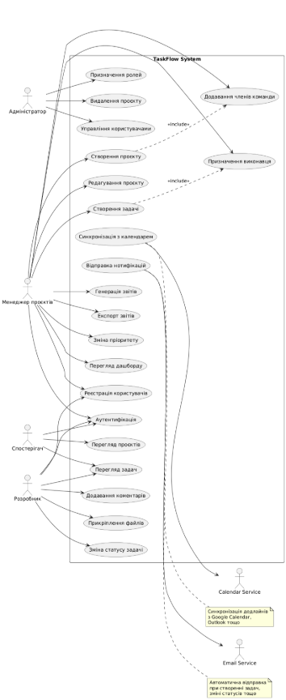
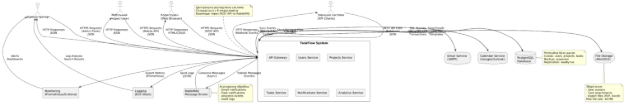

**КИЇВСЬКИЙ НАЦІОНАЛЬНИЙ УНІВЕРСИТЕТ\
БУДІВНИЦТВА ТА АРХІТЕКТУРИ**\
\
\
Кафедра інформаційних технологій\
\
\
\
\
\
**ЛАБОРАТОРНА РОБОТА 1**\
\
з дисципліни

\
**"Архітектура розподілених програмних систем"**\
\
на тему:\
\
**"Аналіз вимог до розподіленої системи "**\
\
\

**\
\
\
\

**\
\

Виконав: студент групи ІПЗм(д)-25\
Постановський Ігор Анатолійович\
\
Перевірив: Мазуренко Р.В.

Київ – 2025
# **Звіт з лабораторної роботи №1**
**Дисципліна:** Архітектура розподілених програмних систем 

**Тема:** Аналіз вимог до розподіленої системи 

**Мета:** Навчитися визначати функціональні та нефункціональні вимоги до РПС
##
## **1. Теоретичні відомості**
### **Розподілена система (distributed system)**
Це сукупність незалежних обчислювальних вузлів (серверів, контейнерів, пристроїв IoT), які взаємодіють між собою через мережу для досягнення спільної мети.
### **Основні властивості розподілених систем:**
- **Масштабованість (Scalability)** — можливість додавати нові вузли без зупинки системи
- **Надійність (Reliability)** — здатність працювати при відмові окремих вузлів
- **Доступність (Availability)** — відсоток часу, коли система доступна користувачам
- **Узгодженість (Consistency)** — однаковий стан даних у різних вузлах
- **Безпека (Security)** — захист даних від несанкціонованого доступу
- **Затримки (Latency)** — час відгуку системи
### **Типи вимог:**
**Функціональні вимоги** описують, що система повинна робити: - користувач може створювати проєкти - система відображає статистику виконання задач - адміністратор має змогу експортувати звіт у PDF

**Нефункціональні вимоги** описують як система повинна працювати: - затримка відповіді ≤ 500 мс - підтримка до 10 000 одночасних з’єднань - доступність 99.9%
##
## **2. Завдання до роботи**
Відповідно до методичних вказівок, необхідно виконати наступні завдання:

1. Обрати предметну область
1. Визначити користувачів та точки взаємодії (веб, мобільний, IoT)
1. Описати нефункціональні вимоги: масштабованість, надійність, безпека
1. Побудувати Use Case Diagram та Context Diagram (опціонально)
##
## **3. Протоколи розв’язання задач**
### **3.1 Обрана предметна область**
**Назва системи:** TaskFlow **Опис:** Розподілена система управління проєктами та задачами

TaskFlow - це платформа для управління проєктами в командах різного розміру. Система дозволяє: - Створювати та організовувати проєкти - Розподіляти задачі між членами команди - Відстежувати прогрес виконання робіт - Аналізувати продуктивність команди - Отримувати сповіщення про важливі події
### **3.2 Користувачі системи**
#### *Зовнішні користувачі:*
1. **Адміністратор**
   - Керує системою загалом
   - Управляє користувачами та правами доступу
   - Налаштовує інтеграції
   - Переглядає системні логи
1. **Менеджер проєктів (Project Manager)**
   - Створює та налаштовує проєкти
   - Додає членів команди
   - Створює та розподіляє задачі
   - Контролює прогрес виконання
   - Генерує звіти
1. **Розробник/Виконавець (Developer)**
   - Переглядає призначені задачі
   - Оновлює статуси задач
   - Залишає коментарі
   - Прикріплює файли
   - Вказує час виконання
1. **Спостерігач (Observer)**
   - Може переглядати проєкти та задачі
   - Доступ тільки для читання
   - Отримує нотифікації про зміни
#### *Інтегровані системи:*
1. **Email Service** - відправка email-повідомлень
1. **Push Notification Service** - push-сповіщення
1. **External Calendar** (Google Calendar, Outlook) - синхронізація дедлайнів
1. **Version Control Systems** (GitHub, GitLab) - опціональна інтеграція
#### *Точки взаємодії:*
1. **Web Application** (React/Vue.js)
   - Основний інтерфейс для роботи
   - Доступний через браузер
   - Повна функціональність
1. **Mobile Application** (React Native - майбутнє)
   - Перегляд задач на ходу
   - Швидкі оновлення статусів
   - Push-нотифікації
1. **REST API**
   - Інтеграція з іншими системами
   - Автоматизація процесів
   - Webhook-и для подій
### **3.3 Функціональні вимоги**
#### *3.3.1 Модуль “Управління користувачами”*
**FR-1.1** Реєстрація користувачів - Система дозволяє новим користувачам зареєструватися - Валідація email адреси - Підтвердження через email

**FR-1.2** Аутентифікація - Вхід через логін/пароль - Вихід з системи - JWT токени для сесій

**FR-1.3** Управління профілем - Редагування особистих даних - Зміна паролю - Завантаження аватара

**FR-1.4** Управління ролями - Призначення ролей користувачам - Контроль доступу на основі ролей (RBAC)
#### *3.3.2 Модуль “Управління проєктами”*
**FR-2.1** Створення проєктів - Користувач може створити новий проєкт - Вказати назву, опис, дедлайн - Вибрати менеджера проєкту

**FR-2.2** Редагування проєктів - Зміна назви та опису - Оновлення дедлайнів - Зміна статусу (Активний, Завершений, Призупинений)

**FR-2.3** Управління командою проєкту - Додавання членів команди - Видалення членів команди - Призначення ролей у проєкті

**FR-2.4** Видалення проєктів - Архівування проєктів - Повне видалення (тільки адміністратор)
#### *3.3.3 Модуль “Управління задачами”*
**FR-3.1** Створення задач - Створення задачі в рамках проєкту - Вказати назву, опис, пріоритет - Встановити дедлайн

**FR-3.2** Призначення виконавців - Призначити одного або кількох виконавців - Повідомлення про призначення

**FR-3.3** Управління статусами - Статуси: Нова, В роботі, На перевірці, Завершена, Відхилена - Зміна статусу з коментарем - Історія змін статусів

**FR-3.4** Управління пріоритетами - Пріоритети: Низький, Середній, Високий, Критичний - Зміна пріоритету менеджером

**FR-3.5** Коментування - Додавання коментарів до задач - Згадування користувачів (@mention) - Прикріплення файлів до коментарів

**FR-3.6** Прикріплення файлів - Завантаження файлів до задачі - Максимальний розмір файлу: 10 МБ - Підтримувані формати: всі
#### *3.3.4 Модуль “Нотифікації”*
**FR-4.1** Email-сповіщення - Нові задачі - Зміни статусів - Нагадування про дедлайни

**FR-4.2** In-app нотифікації - Реалтайм повідомлення в інтерфейсі - Список непрочитаних сповіщень

**FR-4.3** Налаштування нотифікацій - Користувач може вибрати типи сповіщень - Увімкнути/вимкнути окремі канали
#### *3.3.5 Модуль “Аналітика та звіти”*
**FR-5.1** Дашборд проєкту - Загальна статистика проєкту - Кількість задач по статусах - Прогрес виконання (%)

**FR-5.2** Звіти продуктивності - Статистика виконання задач по користувачах - Середній час виконання задач - Burndown chart

**FR-5.3** Експорт звітів - Експорт у PDF - Експорт у CSV/Excel - Налаштування періоду звітності
### **3.4 Нефункціональні вимоги**
#### *3.4.1 Продуктивність (Performance)*
**NFR-1.1** Час відповіді - Середній час відповіді API: ≤ 500 мс - 95-й перцентиль: ≤ 1000 мс - 99-й перцентиль: ≤ 2000 мс

**NFR-1.2** Пропускна здатність - Підтримка до 1000 одночасних користувачів - Обробка до 100 запитів/секунду - Максимальне навантаження: 500 запитів/секунду (пікове)

**NFR-1.3** Розмір даних - Підтримка до 10,000 проєктів - До 100,000 задач - До 50,000 користувачів
#### *3.4.2 Надійність (Reliability)*
**NFR-2.1** Доступність (Availability) - Цільовий uptime: 99.5% (≈43 години простою на рік) - Плановані технічні роботи: поза робочим часом

**NFR-2.2** Відмовостійкість (Fault Tolerance) - Система продовжує працювати при відмові одного мікросервісу - Автоматичний перезапуск контейнерів при збої - Graceful degradation (часткова функціональність при збоях)

**NFR-2.3** Відновлення (Recovery) - Час відновлення після збою (RTO): ≤ 15 хвилин - Втрата даних (RPO): ≤ 1 година - Автоматичне резервне копіювання щоденно
#### *3.4.3 Масштабованість (Scalability)*
**NFR-3.1** Горизонтальне масштабування - Можливість додавання нових інстансів мікросервісів - Автоматичне масштабування при навантаженні - Балансування навантаження між інстансами

**NFR-3.2** Вертикальне масштабування - Можливість збільшення ресурсів (CPU, RAM) для окремих сервісів - Плавне оновлення без простою

**NFR-3.3** Масштабування бази даних - Replication для читання - Sharding за потреби (майбутнє)
#### *3.4.4 Безпека (Security)*
**NFR-4.1** Аутентифікація та авторизація - JWT токени для сесій - Час життя токена: 24 години - Refresh tokens з ротацією - Role-Based Access Control (RBAC)

**NFR-4.2** Шифрування - HTTPS/TLS для всього трафіку - Хешування паролів (bcrypt) - Шифрування чутливих даних в БД

**NFR-4.3** Захист від атак - Rate limiting (обмеження кількості запитів) - CORS для захисту API - SQL injection protection - XSS protection

**NFR-4.4** Логування безпеки - Логування всіх аутентифікацій - Логування змін прав доступу - Логування підозрілої активності
#### *3.4.5 Зручність використання (Usability)*
**NFR-5.1** Інтерфейс - Інтуїтивний та зрозумілий UI - Responsive design (адаптивність) - Підтримка основних браузерів

**NFR-5.2** Доступність - Дотримання базових стандартів доступності - Підтримка клавіатурної навігації
#### *3.4.6 Технологічні вимоги*
**NFR-6.1** Контейнеризація - Всі сервіси упаковані в Docker контейнери - Dockerfile для кожного сервісу - Docker Compose для локальної розробки

**NFR-6.2** Оркестрація - Kubernetes для production (майбутнє) - Підтримка rolling updates - Health checks для всіх сервісів

**NFR-6.3** Моніторинг - Збір метрик (Prometheus) - Візуалізація (Grafana) - Алерти при критичних ситуаціях

**NFR-6.4** Логування - Централізоване логування (ELK/EFK Stack) - Структуроване логування (JSON) - Різні рівні логування (DEBUG, INFO, WARN, ERROR)
### **3.5 Мікросервіси системи (попередня архітектура)**
Система TaskFlow складатиметься з наступних мікросервісів:

1. **API Gateway**
   - Єдина точка входу для клієнтів
   - Маршрутизація запитів до відповідних сервісів
   - Аутентифікація та авторизація
   - Rate limiting
   - Технології: Node.js + Express / Kong
1. **Users Service**
   - Управління користувачами
   - Реєстрація та аутентифікація
   - Профілі користувачів
   - Управління ролями та правами
   - База даних: PostgreSQL
   - Технології: Node.js + Express / Python + FastAPI
1. **Projects Service**
   - Управління проєктами
   - CRUD операції для проєктів
   - Управління командами проєктів
   - База даних: PostgreSQL
   - Технології: Node.js + Express / Python + FastAPI
1. **Tasks Service**
   - Управління задачами
   - CRUD операції для задач
   - Статуси, пріоритети
   - Коментарі та файли
   - База даних: PostgreSQL
   - Технології: Node.js + Express / Python + FastAPI
1. **Notifications Service**
   - Відправка email-повідомлень
   - In-app нотифікації
   - Push-нотифікації (майбутнє)
   - Черга повідомлень: RabbitMQ
   - Технології: Node.js / Python
1. **Analytics Service**
   - Генерація звітів
   - Статистика та метрики
   - Burndown charts
   - Експорт у PDF/Excel
   - База даних: PostgreSQL (read replica) або ClickHouse
   - Технології: Python + Pandas
1. **File Storage Service** (опціонально)
   - Завантаження та зберігання файлів
   - Обробка зображень (thumbnails)
   - Сховище: MinIO / AWS S3
   - Технології: Node.js / Go
### **3.6 Use Case Diagram**
#### *Текстовий опис Use Cases:*
**Актор: Адміністратор** - Управління користувачами (створення, редагування, видалення, блокування) - Призначення ролей - Перегляд системних логів - Налаштування інтеграцій - Управління всіма проєктами

**Актор: Менеджер проєктів** - Створення проєктів - Редагування проєктів - Додавання членів команди - Створення задач - Призначення задач виконавцям - Зміна пріоритетів та статусів - Перегляд аналітики проєкту - Генерація звітів

**Актор: Розробник/Виконавець** - Перегляд призначених задач - Оновлення статусу задачі - Додавання коментарів - Прикріплення файлів - Вказання часу виконання - Перегляд статистики власної роботи

**Актор: Спостерігач** - Перегляд проєктів (read-only) - Перегляд задач (read-only) - Перегляд коментарів

**Актор: Система (зовнішні інтеграції)** - Відправка email-повідомлень - Відправка push-нотифікацій - Синхронізація з календарем
#### *PlantUML код для Use Case Diagram:*
@startuml\
left to right direction\
skinparam packageStyle rectangle\
\
actor "Адміністратор" as Admin\
actor "Менеджер проєктів" as PM\
actor "Розробник" as Dev\
actor "Спостерігач" as Observer\
actor "Email Service" as Email\
actor "Calendar Service" as Calendar\
\
rectangle "TaskFlow System" {\
`  `usecase "Реєстрація користувачів" as UC1\
`  `usecase "Аутентифікація" as UC2\
`  `usecase "Управління користувачами" as UC3\
`  `usecase "Призначення ролей" as UC4\
\
`  `usecase "Створення проєкту" as UC5\
`  `usecase "Редагування проєкту" as UC6\
`  `usecase "Додавання членів команди" as UC7\
`  `usecase "Видалення проєкту" as UC8\
\
`  `usecase "Створення задачі" as UC9\
`  `usecase "Призначення виконавця" as UC10\
`  `usecase "Зміна статусу задачі" as UC11\
`  `usecase "Зміна пріоритету" as UC12\
`  `usecase "Додавання коментарів" as UC13\
`  `usecase "Прикріплення файлів" as UC14\
\
`  `usecase "Перегляд дашборду" as UC15\
`  `usecase "Генерація звітів" as UC16\
`  `usecase "Експорт звітів" as UC17\
\
`  `usecase "Відправка нотифікацій" as UC18\
`  `usecase "Синхронізація з календарем" as UC19\
\
`  `usecase "Перегляд проєктів" as UC20\
`  `usecase "Перегляд задач" as UC21\
}\
\
' Адміністратор\
Admin --> UC3\
Admin --> UC4\
Admin --> UC8\
\
' Менеджер проєктів\
PM --> UC1\
PM --> UC2\
PM --> UC5\
PM --> UC6\
PM --> UC7\
PM --> UC9\
PM --> UC10\
PM --> UC12\
PM --> UC15\
PM --> UC16\
PM --> UC17\
\
' Розробник\
Dev --> UC1\
Dev --> UC2\
Dev --> UC11\
Dev --> UC13\
Dev --> UC14\
Dev --> UC21\
\
' Спостерігач\
Observer --> UC2\
Observer --> UC20\
Observer --> UC21\
\
' Зовнішні системи\
UC18 --> Email\
UC19 --> Calendar\
\
@enduml

### **3.7 Context Diagram**
#### *Текстовий опис Context Diagram:*
**Центральна система:** TaskFlow (Система управління проєктами)

**Зовнішні актори та системи:**

1. **Web Browser** → TaskFlow
   - Користувачі взаємодіють через веб-інтерфейс
   - HTTP/HTTPS запити
   - Отримання HTML/CSS/JS
1. **Mobile App** → TaskFlow
   - Мобільні користувачі (майбутнє)
   - REST API запити
   - Push-нотифікації
1. **TaskFlow** → **Email Service**
   - Відправка email-повідомлень
   - SMTP протокол
1. **TaskFlow** → **External Calendar** (Google Calendar, Outlook)
   - Синхронізація дедлайнів
   - OAuth 2.0 інтеграція
   - Calendar API
1. **TaskFlow** → **File Storage** (MinIO/S3)
   - Зберігання файлів
   - S3-compatible API
1. **External Systems** → **TaskFlow API**
   - Інтеграції через REST API
   - Webhook-и для подій
1. **TaskFlow** → **Monitoring System** (Prometheus/Grafana)
   - Збір метрик
   - Моніторинг стану системи
1. **TaskFlow** → **Logging System** (ELK Stack)
   - Централізоване логування
   - Пошук та аналіз логів
#### *PlantUML код для Context Diagram:*
@startuml\
!define RECTANGLE class\
\
skinparam componentStyle rectangle\
\
actor "Користувач\n(Web Browser)" as User\
actor "Адміністратор" as Admin\
actor "Зовнішні системи\n(API)" as ExtAPI\
\
component "TaskFlow System" as TaskFlow {\
}\
\
database "PostgreSQL\nDatabase" as DB\
queue "RabbitMQ\nMessage Broker" as MQ\
cloud "Email Service\n(SMTP)" as Email\
cloud "Calendar Service\n(Google/Outlook)" as Calendar\
storage "File Storage\n(MinIO/S3)" as Storage\
component "Monitoring\n(Prometheus/Grafana)" as Monitor\
component "Logging\n(ELK Stack)" as Logs\
\
' Взаємодія користувачів\
User --> TaskFlow : "HTTPS Requests\n(REST API)"\
Admin --> TaskFlow : "HTTPS Requests\n(Admin Panel)"\
ExtAPI --> TaskFlow : "REST API Calls\nWebhooks"\
\
' Взаємодія з базою даних\
TaskFlow --> DB : "SQL Queries\n(Read/Write)"\
\
' Взаємодія з черговю повідомлень\
TaskFlow --> MQ : "Publish Messages"\
MQ --> TaskFlow : "Consume Messages"\
\
' Зовнішні сервіси\
TaskFlow --> Email : "Send Emails\n(SMTP)"\
TaskFlow --> Calendar : "Sync Events\n(OAuth 2.0)"\
TaskFlow --> Storage : "Store/Retrieve Files\n(S3 API)"\
\
' Моніторинг та логування\
TaskFlow --> Monitor : "Export Metrics"\
TaskFlow --> Logs : "Send Logs"\
\
@enduml

### **3.8 Технологічний стек (попередній)**
#### *Backend:*
- **Мова програмування:** Node.js (JavaScript/TypeScript) або Python
- **Фреймворки:** Express.js (Node.js) / FastAPI (Python)
- **API:** REST (основний), gRPC (між сервісами - опціонально)
#### *Database:*
- **Основна БД:** PostgreSQL
- **Кешування:** Redis (майбутнє)
- **Черга повідомлень:** RabbitMQ
#### *Frontend:*
- **Фреймворк:** React або Vue.js
- **State Management:** Redux / Vuex
- **UI Library:** Material-UI / Ant Design
#### *DevOps:*
- **Контейнеризація:** Docker
- **Оркестрація:** Docker Compose (розробка), Kubernetes (production - майбутнє)
- **CI/CD:** GitHub Actions
- **Моніторинг:** Prometheus + Grafana
- **Логування:** ELK Stack (Elasticsearch, Logstash, Kibana)
#### *Інструменти розробки:*
- **Version Control:** Git + GitHub
- **API Testing:** Postman / Insomnia
- **Database Tool:** DBeaver / pgAdmin
- **Load Testing:** k6 / Apache JMeter
-----
## **4. Висновки**
У ході виконання лабораторної роботи №1 було проведено аналіз вимог до розподіленої системи управління проєктами **TaskFlow**.

**Основні результати:**

1. **Визначено предметну область:** Система управління проєктами та задачами для команд
1. **Ідентифіковано користувачів системи:**
   - Адміністратор
   - Менеджер проєктів
   - Розробник/Виконавець
   - Спостерігач
   - Зовнішні інтегровані системи
1. **Визначено функціональні вимоги:**
   - 27 основних функціональних вимог
   - 5 модулів системи (Users, Projects, Tasks, Notifications, Analytics)
   - Детальний опис кожної функції
1. **Визначено нефункціональні вимоги:**
   - Продуктивність: ≤ 500 мс час відповіді, 1000 одночасних користувачів
   - Надійність: 99.5% uptime, автоматичне відновлення
   - Масштабованість: горизонтальне та вертикальне масштабування
   - Безпека: JWT, HTTPS, RBAC, захист від атак
   - Технологічні вимоги: Docker, PostgreSQL, RabbitMQ
1. **Розроблено попередню архітектуру:**
   - 6-7 мікросервісів
   - API Gateway як єдина точка входу
   - Асинхронна взаємодія через RabbitMQ
   - Централізоване логування та моніторинг
1. **Створено діаграми:**
   - Use Case Diagram - показує взаємодію користувачів з системою
   - Context Diagram - показує систему в контексті зовнішнього середовища

**Практична цінність:**

Проведений аналіз вимог є фундаментом для подальшого проєктування та розробки системи. Чітко визначені вимоги дозволяють: - Уникнути помилок на етапі розробки - Правильно спроєктувати архітектуру - Оцінити складність та терміни реалізації - Забезпечити відповідність системи очікуванням користувачів

**Наступні кроки:**

На основі проведеного аналізу вимог у наступних лабораторних роботах буде виконано: - ЛР №2: Проєктування мікросервісної архітектури - ЛР №3: Моделювання взаємодії між сервісами - ЛР №4: Розробка технологічної архітектури - ЛР №5-9: Практична реалізація системи

**Висновок:** Лабораторна робота №1 успішно виконана. Проведено повний аналіз вимог до розподіленої системи TaskFlow, що дає змогу перейти до наступного етапу - проєктування мікросервісної архітектури.

-----
**Контрольні запитання:**

1. **Що таке розподілена система?** Відповідь: Розподілена система — це сукупність незалежних обчислювальних вузлів, які взаємодіють між собою через мережу для досягнення спільної мети.
1. **Які типи архітектур використовуються у розподілених системах?** Відповідь: Клієнт-сервер, мікросервіси, подієво-орієнтована архітектура (event-driven), P2P, serverless.
1. **Що таке функціональні та нефункціональні вимоги?** Відповідь: Функціональні вимоги описують, що система повинна робити (функції). Нефункціональні описують, як система повинна працювати (продуктивність, надійність, безпека).
1. **Як визначають користувачів і зацікавлені сторони системи?** Відповідь: Шляхом аналізу предметної області, інтерв’ювання стейкхолдерів, вивчення подібних систем, визначення ролей та їх обов’язків.
1. **Що таке контекстна діаграма і для чого вона потрібна?** Відповідь: Context Diagram показує систему як “чорну скриньку” в контексті зовнішнього середовища, відображає зовнішніх акторів та потоки даних між ними.
1. **Які типові ризики при проєктуванні розподілених систем?** Відповідь: Недооцінка складності взаємодії між сервісами, проблеми з узгодженістю даних, складність моніторингу, проблеми з безпекою, недостатня продуктивність.
1. **Як вимоги впливають на вибір архітектурного стилю?** Відповідь: Нефункціональні вимоги (масштабованість, надійність) визначають потребу в мікросервісній архітектурі. Вимоги до реального часу можуть вимагати event-driven підходу. Складність системи визначає рівень розподіленості.

**Додатки:**

- Додаток А: PlantUML код для Use Case Diagram
- Додаток Б: PlantUML код для Context Diagram
- Додаток В: Список літератури та корисних посилань

**Корисні посилання:** - PlantUML Online: https://www.plantuml.com/plantuml/uml/ - Docker Documentation: https://docs.docker.com/ - PostgreSQL: https://www.postgresql.org/ - RabbitMQ: https://www.rabbitmq.com/
