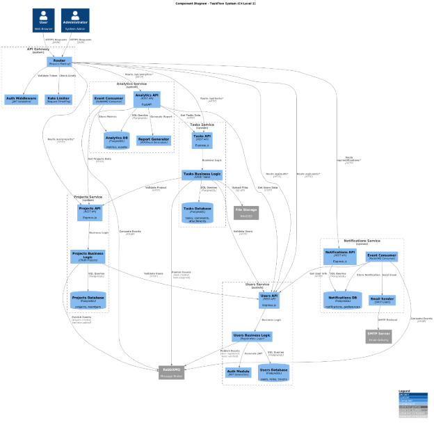
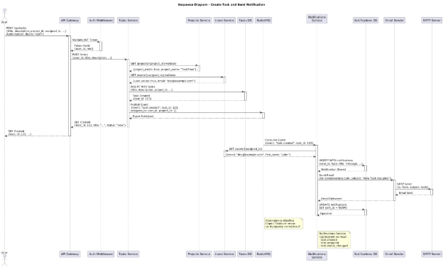

**КИЇВСЬКИЙ НАЦІОНАЛЬНИЙ УНІВЕРСИТЕТ\
БУДІВНИЦТВА ТА АРХІТЕКТУРИ**\
\
\
Кафедра інформаційних технологій\
\
\
\
\
\
**ЛАБОРАТОРНА РОБОТА 2**\
\
з дисципліни

\
**"** **Архітектура розподілених програмних систем"**\
\
на тему:\
\
**"** **Проєктування мікросервісної архітектури "**\
\
\

**\
\
\
\

**\
\

Виконав: студент групи ІПЗм(д)-25\
Постановський Ігор Анатолійович\
\
Перевірив: Мазуренко Р.В.

Київ – 2025
# **Звіт з лабораторної роботи №2**
**Дисципліна:** Архітектура розподілених програмних систем 

**Тема:** Проєктування мікросервісної архітектури 

**Мета:** Навчитися декомпозувати систему на мікросервіси
##
## **1. Теоретичні відомості**
### **1.1 Мікросервісна архітектура**
**Мікросервісна архітектура (microservice architecture)** — це підхід до проєктування програмних систем, у якому застосунок розділяється на низку незалежних сервісів, кожен з яких виконує одну чітку бізнес-функцію та взаємодіє з іншими через добре визначений інтерфейс (зазвичай REST або gRPC API).
### **1.2 Ключові принципи мікросервісів**
**1. Single Responsibility Principle (Принцип єдиної відповідальності)** - Кожен мікросервіс відповідає за одну бізнес-функцію - Приклад: Users Service відповідає тільки за користувачів, Tasks Service — тільки за задачі

**2. Loose Coupling (Слабке зв’язування)** - Мікросервіси мінімально залежать один від одного - Зміни в одному сервісі не впливають на інші - Взаємодія через добре визначені інтерфейси

**3. High Cohesion (Висока зв’язність)** - Всі функції всередині сервісу тісно пов’язані між собою - Приклад: в Tasks Service всі операції пов’язані з задачами

**4. Bounded Context (Обмежений контекст)** - Кожен сервіс має власну модель даних - Не дублює функціональність інших сервісів - Чіткі межі відповідальності

**5. Database per Service (База даних на сервіс)** - Кожен мікросервіс має власну базу даних - Інші сервіси не мають прямого доступу до цієї БД - Уникнення конфліктів при оновленнях

**6. Independent Deployment (Незалежне розгортання)** - Сервіс може бути розгорнутий незалежно від інших - Не потрібно зупиняти всю систему для оновлення

**7. Decentralized Data Management (Децентралізоване управління даними)** - Кожен сервіс управляє своїми даними - Немає єдиної центральної бази даних
### **1.3 Переваги мікросервісної архітектури**
- **Масштабованість:** - Можна масштабувати тільки потрібні сервіси - Ефективніше використання ресурсів
- **Гнучкість технологій:** - Різні сервіси можуть використовувати різні технології - Можна вибрати найкращий інструмент для конкретної задачі
- **Незалежна розробка:** - Різні команди можуть працювати над різними сервісами - Паралельна розробка прискорює процес
- **Стійкість до відмов:** - Збій одного сервісу не зупиняє всю систему - Можливість graceful degradation
- **Легше оновлення:** - Можна оновлювати сервіси незалежно - Менший ризик при змінах
### **1.4 Недоліки мікросервісної архітектури**
- **Складність:** - Більше компонентів для управління - Потрібна оркестрація (Kubernetes) - Складніший моніторинг
- **Мережева взаємодія:** - Додаткові затримки через мережу - Потрібно обробляти помилки мережі
- **Узгодженість даних:** - Складніше забезпечити транзакційність - Потрібні розподілені транзакції або саги
- **Тестування:** - Складніше тестувати взаємодію між сервісами - Потрібні інтеграційні тести
- **Вищі вимоги до DevOps:** - Потрібна автоматизація розгортання - CI/CD пайплайни - Контейнеризація
### **1.5 Відмінність від монолітної архітектури**

|Характеристика|Моноліт|Мікросервіси|
| :- | :- | :- |
|**Структура**|Єдиний застосунок|Набір незалежних сервісів|
|**База даних**|Одна спільна БД|БД на кожен сервіс|
|**Розгортання**|Весь застосунок одразу|Кожен сервіс окремо|
|**Масштабування**|Тільки вертикальне|Горизонтальне по сервісах|
|**Технології**|Одна технологія|Різні технології|
|**Складність**|Простіше на старті|Складніше з самого початку|
|**Команда**|Одна команда|Декілька команд|
### **1.6 API Gateway**
**API Gateway** — це єдина точка входу для всіх клієнтських запитів до мікросервісів.

**Функції API Gateway:** - Маршрутизація запитів до відповідних сервісів - Аутентифікація та авторизація - Rate limiting (обмеження кількості запитів) - Кешування відповідей - Агрегація даних з кількох сервісів - Трансформація запитів/відповідей - Моніторинг та логування

**Популярні рішення:** - Kong - AWS API Gateway - NGINX - Traefik - Custom (Node.js + Express)
### **1.7 Взаємодія між мікросервісами**
**Синхронна взаємодія:** - REST API (HTTP/HTTPS) - gRPC (HTTP/2) - Клієнт чекає на відповідь

**Асинхронна взаємодія:** - Message Brokers (RabbitMQ, Kafka) - Event-driven architecture - Клієнт не чекає на відповідь
##
## **2. Завдання до роботи**
Відповідно до методичних вказівок, необхідно:

1. Визначити 2-3 основних мікросервісів (у нашому випадку буде 6 мікросервісів)
1. Для кожного мікросервісу визначити:
   - Відповідальність (bounded context)
   - API endpoints
   - Структуру бази даних
   - Черги повідомлень
1. Побудувати Component Diagram або C4 Level 2
##
## **3. Протоколи розв’язання задач**
### **3.1 Архітектурний огляд системи TaskFlow**
Система TaskFlow складається з наступних компонентів:

┌─────────────────────────────────────────────────────────────────┐\
│                          Web Browser                            │\
│                      (React/Vue.js Client)                      │\
└────────────────────────────┬────────────────────────────────────┘\
`                             `│ HTTPS\
`                             `▼\
┌─────────────────────────────────────────────────────────────────┐\
│                         API Gateway                             │\
│              (Kong / NGINX / Custom Node.js)                    │\
│  ┌──────────┐  ┌──────────┐  ┌──────────┐  ┌──────────┐      │\
│  │  Auth    │  │  Rate    │  │ Request  │  │  Cache   │      │\
│  │Middleware│  │ Limiting │  │ Routing  │  │          │      │\
│  └──────────┘  └──────────┘  └──────────┘  └──────────┘      │\
└────────────┬──────────┬──────────┬──────────┬─────────────────┘\
`             `│          │          │          │\
`    `┌────────┼──────────┼──────────┼──────────┼────────┐\
`    `│        │          │          │          │        │\
`    `▼        ▼          ▼          ▼          ▼        ▼\
┌────────┐┌────────┐┌────────┐┌────────┐┌────────┐┌────────┐\
│ Users  ││Projects││ Tasks  ││Notific.││Analyt. ││Files   │\
│Service ││Service ││Service ││Service ││Service ││Service │\
└───┬────┘└───┬────┘└───┬────┘└───┬────┘└───┬────┘└────────┘\
`    `│         │         │         │         │\
`    `▼         ▼         ▼         ▼         ▼\
┌────────┐┌────────┐┌────────┐           ┌────────┐\
│Users DB││Projects││Tasks DB│           │Analytics│\
│        ││  DB    ││        │           │   DB    │\
└────────┘└────────┘└────────┘           └────────┘\
`                             `│\
`                             `▼\
`                     `┌──────────────┐\
`                     `│  RabbitMQ    │\
`                     `│Message Broker│\
`                     `└──────────────┘
### **3.2 Детальний опис мікросервісів**
## **3.2.1 API Gateway**
### **Відповідальність (Bounded Context):**
- Єдина точка входу для всіх клієнтських запитів
- Маршрутизація до відповідних мікросервісів
- Аутентифікація та авторизація
- Rate limiting та захист від атак
### **Технічний стек:**
- **Технологія:** Node.js + Express або Kong
- **Порт:** 3000
- **Протокол:** HTTP/HTTPS
### **Основні функції:**
**1. Аутентифікація:** - Перевірка JWT токенів - Валідація access/refresh tokens - Forwarding user context до сервісів

**2. Маршрутизація:** - /api/auth/\* → Users Service - /api/users/\* → Users Service - /api/projects/\* → Projects Service - /api/tasks/\* → Tasks Service - /api/analytics/\* → Analytics Service

**3. Rate Limiting:** - Обмеження: 100 запитів/хвилину на IP - Обмеження: 1000 запитів/хвилину на користувача

**4. Додаткові функції:** - Request/Response logging - CORS configuration - Request transformation - Response caching (опціонально)
### **Конфігурація (приклад для Node.js):**
*// api-gateway/src/routes.js*\
**const** routes = {\
`  `'/api/auth': {\
`    `target: 'http://users-service:4001',\
`    `changeOrigin: **true**\
`  `},\
`  `'/api/users': {\
`    `target: 'http://users-service:4001',\
`    `changeOrigin: **true**,\
`    `auth: **true**  *// Requires authentication*\
`  `},\
`  `'/api/projects': {\
`    `target: 'http://projects-service:4002',\
`    `changeOrigin: **true**,\
`    `auth: **true**\
`  `},\
`  `'/api/tasks': {\
`    `target: 'http://tasks-service:4003',\
`    `changeOrigin: **true**,\
`    `auth: **true**\
`  `},\
`  `'/api/notifications': {\
`    `target: 'http://notifications-service:4004',\
`    `changeOrigin: **true**,\
`    `auth: **true**\
`  `},\
`  `'/api/analytics': {\
`    `target: 'http://analytics-service:4005',\
`    `changeOrigin: **true**,\
`    `auth: **true**\
`  `}\
};
### **Змінні оточення:**
PORT=3000\
JWT\_SECRET=your-secret-key\
USERS\_SERVICE\_URL=http://users-service:4001\
PROJECTS\_SERVICE\_URL=http://projects-service:4002\
TASKS\_SERVICE\_URL=http://tasks-service:4003\
NOTIFICATIONS\_SERVICE\_URL=http://notifications-service:4004\
ANALYTICS\_SERVICE\_URL=http://analytics-service:4005\
RATE\_LIMIT\_WINDOW=60000\
RATE\_LIMIT\_MAX\_REQUESTS=100
##
## **3.2.2 Users Service (Сервіс користувачів)**
### **Відповідальність (Bounded Context):**
- Управління користувачами системи
- Реєстрація та аутентифікація
- Управління профілями
- Управління ролями та правами доступу
### **Технічний стек:**
- **Технологія:** Node.js + Express + TypeScript або Python + FastAPI
- **База даних:** PostgreSQL
- **Порт:** 4001
- **Протокол:** HTTP (внутрішня мережа)
### **Структура бази даних:**
*-- Таблиця користувачів*\
**CREATE** **TABLE** users (\
`    `**id** SERIAL **PRIMARY** **KEY**,\
`    `email VARCHAR(255) **UNIQUE** **NOT** **NULL**,\
`    `password\_hash VARCHAR(255) **NOT** **NULL**,\
`    `first\_name VARCHAR(100) **NOT** **NULL**,\
`    `last\_name VARCHAR(100) **NOT** **NULL**,\
`    `avatar\_url VARCHAR(500),\
`    `is\_active BOOLEAN **DEFAULT** **true**,\
`    `is\_verified BOOLEAN **DEFAULT** **false**,\
`    `created\_at TIMESTAMP **DEFAULT** CURRENT\_TIMESTAMP,\
`    `updated\_at TIMESTAMP **DEFAULT** CURRENT\_TIMESTAMP\
);\
\
*-- Таблиця ролей*\
**CREATE** **TABLE** **roles** (\
`    `**id** SERIAL **PRIMARY** **KEY**,\
`    `name VARCHAR(50) **UNIQUE** **NOT** **NULL**,  *-- 'admin', 'manager', 'developer', 'observer'*\
`    `description TEXT,\
`    `created\_at TIMESTAMP **DEFAULT** CURRENT\_TIMESTAMP\
);\
\
*-- Зв'язок користувачів та ролей (Many-to-Many)*\
**CREATE** **TABLE** user\_roles (\
`    `user\_id INTEGER **REFERENCES** users(**id**) **ON** **DELETE** **CASCADE**,\
`    `role\_id INTEGER **REFERENCES** **roles**(**id**) **ON** **DELETE** **CASCADE**,\
`    `assigned\_at TIMESTAMP **DEFAULT** CURRENT\_TIMESTAMP,\
`    `**PRIMARY** **KEY** (user\_id, role\_id)\
);\
\
*-- Таблиця refresh токенів*\
**CREATE** **TABLE** refresh\_tokens (\
`    `**id** SERIAL **PRIMARY** **KEY**,\
`    `user\_id INTEGER **REFERENCES** users(**id**) **ON** **DELETE** **CASCADE**,\
`    `token VARCHAR(500) **UNIQUE** **NOT** **NULL**,\
`    `expires\_at TIMESTAMP **NOT** **NULL**,\
`    `created\_at TIMESTAMP **DEFAULT** CURRENT\_TIMESTAMP\
);\
\
*-- Індекси для оптимізації*\
**CREATE** **INDEX** idx\_users\_email **ON** users(email);\
**CREATE** **INDEX** idx\_users\_active **ON** users(is\_active);\
**CREATE** **INDEX** idx\_refresh\_tokens\_user **ON** refresh\_tokens(user\_id);\
**CREATE** **INDEX** idx\_refresh\_tokens\_token **ON** refresh\_tokens(token);
### **API Endpoints:**
#### *Аутентифікація:*
**POST /api/auth/register** - Реєстрація нового користувача - Body: { email, password, firstName, lastName } - Response: { user, accessToken, refreshToken }

**POST /api/auth/login** - Вхід в систему - Body: { email, password } - Response: { user, accessToken, refreshToken }

**POST /api/auth/logout** - Вихід з системи - Headers: Authorization: Bearer <token> - Response: { message: "Logged out successfully" }

**POST /api/auth/refresh** - Оновлення access token - Body: { refreshToken } - Response: { accessToken, refreshToken }

**POST /api/auth/verify-email** - Підтвердження email - Body: { token } - Response: { message: "Email verified" }

**POST /api/auth/forgot-password** - Запит на скидання паролю - Body: { email } - Response: { message: "Reset email sent" }

**POST /api/auth/reset-password** - Скидання паролю - Body: { token, newPassword } - Response: { message: "Password reset successfully" }
#### *Управління користувачами:*
**GET /api/users** - Отримання списку користувачів (з пагінацією) - Query: ?page=1&limit=20&search=john&role=developer - Response: { users: [], total, page, limit }

**GET /api/users/:id** - Отримання користувача за ID - Response: { id, email, firstName, lastName, roles, ... }

**GET /api/users/me** - Отримання профілю поточного користувача - Headers: Authorization: Bearer <token> - Response: { id, email, firstName, lastName, roles, ... }

**PUT /api/users/me** - Оновлення профілю поточного користувача - Headers: Authorization: Bearer <token> - Body: { firstName, lastName, avatarUrl } - Response: { user }

**PUT /api/users/:id** - Оновлення користувача (тільки admin) - Body: { firstName, lastName, isActive } - Response: { user }

**DELETE /api/users/:id** - Видалення користувача (тільки admin) - Response: { message: "User deleted" }
#### *Управління ролями:*
**GET /api/users/:id/roles** - Отримання ролей користувача - Response: { roles: [] }

**POST /api/users/:id/roles** - Призначення ролі користувачу (тільки admin) - Body: { roleId } - Response: { message: "Role assigned" }

**DELETE /api/users/:id/roles/:roleId** - Видалення ролі у користувача (тільки admin) - Response: { message: "Role removed" }
### **Бізнес-логіка:**
**Реєстрація користувача:** 1. Валідація даних (email, пароль) 2. Перевірка чи email вже існує 3. Хешування паролю (bcrypt) 4. Створення користувача в БД 5. Призначення ролі “developer” за замовчуванням 6. Генерація JWT токенів (access + refresh) 7. Відправка email для верифікації (через RabbitMQ) 8. Повернення токенів

**Аутентифікація:** 1. Пошук користувача за email 2. Перевірка паролю 3. Перевірка чи користувач активний 4. Генерація JWT токенів 5. Збереження refresh token в БД 6. Повернення токенів

**Оновлення токена:** 1. Валідація refresh token 2. Перевірка в БД 3. Перевірка терміну дії 4. Генерація нового access token 5. Ротація refresh token (створення нового) 6. Видалення старого refresh token 7. Повернення нових токенів
### **Взаємодія з іншими сервісами:**
**→ Notifications Service (асинхронно через RabbitMQ):** - user.registered - подія реєстрації користувача - user.password\_reset\_requested - запит на скидання паролю - user.email\_verified - email підтверджено

**← Projects Service, Tasks Service (синхронно через REST):** - Запити для валідації користувачів - Отримання інформації про користувачів
### **Змінні оточення:**
PORT=4001\
DB\_HOST=users-db\
DB\_PORT=5432\
DB\_NAME=users\_db\
DB\_USER=postgres\
DB\_PASSWORD=password\
JWT\_SECRET=your-jwt-secret\
JWT\_ACCESS\_EXPIRATION=15m\
JWT\_REFRESH\_EXPIRATION=7d\
RABBITMQ\_URL=amqp://rabbitmq:5672\
BCRYPT\_ROUNDS=10
##
## **3.2.3 Projects Service (Сервіс проєктів)**
### **Відповідальність (Bounded Context):**
- Управління проєктами
- Управління командами проєктів
- Контроль доступу до проєктів
### **Технічний стек:**
- **Технологія:** Node.js + Express + TypeScript
- **База даних:** PostgreSQL
- **Порт:** 4002
- **Протокол:** HTTP
### **Структура бази даних:**
*-- Таблиця проєктів*\
**CREATE** **TABLE** projects (\
`    `**id** SERIAL **PRIMARY** **KEY**,\
`    `name VARCHAR(200) **NOT** **NULL**,\
`    `description TEXT,\
`    `owner\_id INTEGER **NOT** **NULL**,  *-- ID користувача з Users Service*\
`    `status VARCHAR(50) **DEFAULT** 'active',  *-- 'active', 'completed', 'suspended', 'archived'*\
`    `start\_date DATE,\
`    `end\_date DATE,\
`    `deadline DATE,\
`    `priority VARCHAR(20) **DEFAULT** 'medium',  *-- 'low', 'medium', 'high', 'critical'*\
`    `created\_at TIMESTAMP **DEFAULT** CURRENT\_TIMESTAMP,\
`    `updated\_at TIMESTAMP **DEFAULT** CURRENT\_TIMESTAMP\
);\
\
*-- Таблиця членів команди проєкту*\
**CREATE** **TABLE** project\_members (\
`    `**id** SERIAL **PRIMARY** **KEY**,\
`    `project\_id INTEGER **REFERENCES** projects(**id**) **ON** **DELETE** **CASCADE**,\
`    `user\_id INTEGER **NOT** **NULL**,  *-- ID користувача з Users Service*\
`    `**role** VARCHAR(50) **DEFAULT** 'member',  *-- 'owner', 'manager', 'member', 'observer'*\
`    `joined\_at TIMESTAMP **DEFAULT** CURRENT\_TIMESTAMP\
);\
\
*-- Унікальний індекс щоб користувач не міг двічі бути в одному проєкті*\
**CREATE** **UNIQUE** **INDEX** idx\_project\_members\_unique **ON** project\_members(project\_id, user\_id);\
\
*-- Індекси для оптимізації*\
**CREATE** **INDEX** idx\_projects\_owner **ON** projects(owner\_id);\
**CREATE** **INDEX** idx\_projects\_status **ON** projects(status);\
**CREATE** **INDEX** idx\_project\_members\_user **ON** project\_members(user\_id);\
**CREATE** **INDEX** idx\_project\_members\_project **ON** project\_members(project\_id);
### **API Endpoints:**
#### *CRUD Операції для проєктів:*
**GET /api/projects** - Отримання списку проєктів (тільки ті, до яких користувач має доступ) - Query: ?page=1&limit=20&status=active&search=name - Response: { projects: [], total, page, limit }

**GET /api/projects/:id** - Отримання проєкту за ID - Response: { id, name, description, owner, members, tasks\_count, ... }

**POST /api/projects** - Створення нового проєкту - Body: { name, description, startDate, endDate, deadline, priority } - Response: { project }

**PUT /api/projects/:id** - Оновлення проєкту (тільки owner або manager) - Body: { name, description, status, deadline, priority } - Response: { project }

**DELETE /api/projects/:id** - Видалення проєкту (тільки owner) - Response: { message: "Project deleted" }
#### *Управління командою:*
**GET /api/projects/:id/members** - Отримання членів команди проєкту - Response: { members: [{ userId, role, joinedAt, userInfo }] }

**POST /api/projects/:id/members** - Додавання члена команди (тільки owner або manager) - Body: { userId, role } - Response: { message: "Member added" }

**PUT /api/projects/:id/members/:userId** - Зміна ролі члена команди (тільки owner) - Body: { role } - Response: { message: "Role updated" }

**DELETE /api/projects/:id/members/:userId** - Видалення члена команди (тільки owner) - Response: { message: "Member removed" }
#### *Статистика:*
**GET /api/projects/:id/stats** - Отримання статистики проєкту - Response: { totalTasks, completedTasks, inProgressTasks, memberCount, progress }
### **Бізнес-логіка:**
**Створення проєкту:** 1. Валідація даних 2. Створення проєкту в БД 3. Автоматичне додавання створювача як owner 4. Публікація події project.created (RabbitMQ) 5. Повернення створеного проєкту

**Додавання члена команди:** 1. Перевірка чи користувач має права (owner або manager) 2. Перевірка чи користувач вже є в команді 3. Валідація userId (запит до Users Service) 4. Додавання в БД 5. Публікація події project.member\_added (RabbitMQ) 6. Відправка нотифікації новому члену

**Видалення проєкту:** 1. Перевірка прав (тільки owner) 2. Перевірка чи є активні задачі (запит до Tasks Service) 3. Архівування або видалення 4. Публікація події project.deleted (RabbitMQ) 5. Видалення всіх пов’язаних задач (через Tasks Service)
### **Взаємодія з іншими сервісами:**
**→ Users Service (синхронно через REST):** - GET /api/users/:id - перевірка існування користувача - GET /api/users/batch - отримання інфо про кількох користувачів

**→ Tasks Service (синхронно через REST):** - GET /api/tasks?projectId=:id - отримання задач проєкту - DELETE /api/tasks?projectId=:id - видалення всіх задач проєкту

**→ Notifications Service (асинхронно через RabbitMQ):** - project.created - проєкт створено - project.updated - проєкт оновлено - project.member\_added - додано нового члена команди - project.member\_removed - видалено члена команди - project.deadline\_approaching - наближається дедлайн
### **Змінні оточення:**
PORT=4002\
DB\_HOST=projects-db\
DB\_PORT=5432\
DB\_NAME=projects\_db\
DB\_USER=postgres\
DB\_PASSWORD=password\
USERS\_SERVICE\_URL=http://users-service:4001\
TASKS\_SERVICE\_URL=http://tasks-service:4003\
RABBITMQ\_URL=amqp://rabbitmq:5672
##
## **3.2.4 Tasks Service (Сервіс задач)**
### **Відповідальність (Bounded Context):**
- Управління задачами
- Управління статусами та пріоритетами
- Коментарі до задач
- Прикріплення файлів до задач
### **Технічний стек:**
- **Технологія:** Node.js + Express + TypeScript
- **База даних:** PostgreSQL
- **Порт:** 4003
- **Протокол:** HTTP
### **Структура бази даних:**
*-- Таблиця задач*\
**CREATE** **TABLE** tasks (\
`    `**id** SERIAL **PRIMARY** **KEY**,\
`    `project\_id INTEGER **NOT** **NULL**,  *-- ID проєкту з Projects Service*\
`    `title VARCHAR(300) **NOT** **NULL**,\
`    `description TEXT,\
`    `assignee\_id INTEGER,  *-- ID виконавця з Users Service (може бути NULL)*\
`    `reporter\_id INTEGER **NOT** **NULL**,  *-- ID створювача з Users Service*\
`    `status VARCHAR(50) **DEFAULT** 'new',  *-- 'new', 'in\_progress', 'in\_review', 'completed', 'rejected'*\
`    `priority VARCHAR(20) **DEFAULT** 'medium',  *-- 'low', 'medium', 'high', 'critical'*\
`    `due\_date TIMESTAMP,\
`    `estimated\_hours DECIMAL(5,2),\
`    `actual\_hours DECIMAL(5,2),\
`    `created\_at TIMESTAMP **DEFAULT** CURRENT\_TIMESTAMP,\
`    `updated\_at TIMESTAMP **DEFAULT** CURRENT\_TIMESTAMP,\
`    `completed\_at TIMESTAMP\
);\
\
*-- Таблиця коментарів*\
**CREATE** **TABLE** task\_comments (\
`    `**id** SERIAL **PRIMARY** **KEY**,\
`    `task\_id INTEGER **REFERENCES** tasks(**id**) **ON** **DELETE** **CASCADE**,\
`    `user\_id INTEGER **NOT** **NULL**,  *-- ID користувача з Users Service*\
`    `content TEXT **NOT** **NULL**,\
`    `created\_at TIMESTAMP **DEFAULT** CURRENT\_TIMESTAMP,\
`    `updated\_at TIMESTAMP **DEFAULT** CURRENT\_TIMESTAMP\
);\
\
*-- Таблиця файлів*\
**CREATE** **TABLE** task\_attachments (\
`    `**id** SERIAL **PRIMARY** **KEY**,\
`    `task\_id INTEGER **REFERENCES** tasks(**id**) **ON** **DELETE** **CASCADE**,\
`    `user\_id INTEGER **NOT** **NULL**,  *-- ID користувача з Users Service*\
`    `filename VARCHAR(255) **NOT** **NULL**,\
`    `file\_url VARCHAR(500) **NOT** **NULL**,\
`    `file\_size INTEGER,  *-- в байтах*\
`    `mime\_type VARCHAR(100),\
`    `uploaded\_at TIMESTAMP **DEFAULT** CURRENT\_TIMESTAMP\
);\
\
*-- Таблиця історії змін статусів*\
**CREATE** **TABLE** task\_status\_history (\
`    `**id** SERIAL **PRIMARY** **KEY**,\
`    `task\_id INTEGER **REFERENCES** tasks(**id**) **ON** **DELETE** **CASCADE**,\
`    `user\_id INTEGER **NOT** **NULL**,  *-- ID користувача з Users Service*\
`    `old\_status VARCHAR(50),\
`    `new\_status VARCHAR(50) **NOT** **NULL**,\
`    `**comment** TEXT,\
`    `changed\_at TIMESTAMP **DEFAULT** CURRENT\_TIMESTAMP\
);\
\
*-- Індекси для оптимізації*\
**CREATE** **INDEX** idx\_tasks\_project **ON** tasks(project\_id);\
**CREATE** **INDEX** idx\_tasks\_assignee **ON** tasks(assignee\_id);\
**CREATE** **INDEX** idx\_tasks\_status **ON** tasks(status);\
**CREATE** **INDEX** idx\_tasks\_priority **ON** tasks(priority);\
**CREATE** **INDEX** idx\_task\_comments\_task **ON** task\_comments(task\_id);\
**CREATE** **INDEX** idx\_task\_attachments\_task **ON** task\_attachments(task\_id);\
**CREATE** **INDEX** idx\_task\_status\_history\_task **ON** task\_status\_history(task\_id);
### **API Endpoints:**
#### *CRUD Операції для задач:*
**GET /api/tasks** - Отримання списку задач - Query: ?projectId=1&assigneeId=5&status=in\_progress&priority=high&page=1&limit=20 - Response: { tasks: [], total, page, limit }

**GET /api/tasks/:id** - Отримання задачі за ID - Response: { id, title, description, project, assignee, reporter, status, comments, attachments, ... }

**POST /api/tasks** - Створення нової задачі - Body: { projectId, title, description, assigneeId, priority, dueDate, estimatedHours } - Response: { task }

**PUT /api/tasks/:id** - Оновлення задачі - Body: { title, description, assigneeId, priority, dueDate, estimatedHours } - Response: { task }

**DELETE /api/tasks/:id** - Видалення задачі - Response: { message: "Task deleted" }
#### *Управління статусами:*
**PATCH /api/tasks/:id/status** - Зміна статусу задачі - Body: { status, comment } - Response: { task }

**GET /api/tasks/:id/status-history** - Отримання історії змін статусів - Response: { history: [] }
#### *Коментарі:*
**GET /api/tasks/:id/comments** - Отримання коментарів задачі - Response: { comments: [] }

**POST /api/tasks/:id/comments** - Додавання коментаря - Body: { content } - Response: { comment }

**PUT /api/tasks/:taskId/comments/:commentId** - Редагування коментаря (тільки автор) - Body: { content } - Response: { comment }

**DELETE /api/tasks/:taskId/comments/:commentId** - Видалення коментаря (тільки автор) - Response: { message: "Comment deleted" }
#### *Файли:*
**GET /api/tasks/:id/attachments** - Отримання списку файлів - Response: { attachments: [] }

**POST /api/tasks/:id/attachments** - Завантаження файлу - Body: multipart/form-data with file - Response: { attachment }

**DELETE /api/tasks/:taskId/attachments/:attachmentId** - Видалення файлу - Response: { message: "Attachment deleted" }
#### *Час виконання:*
**PATCH /api/tasks/:id/actual-hours** - Вказання фактичного часу виконання - Body: { actualHours } - Response: { task }
### **Бізнес-логіка:**
**Створення задачі:** 1. Валідація даних 2. Перевірка чи проєкт існує (запит до Projects Service) 3. Перевірка чи користувач має доступ до проєкту 4. Перевірка чи assignee існує (запит до Users Service) 5. Створення задачі в БД 6. Публікація події task.created (RabbitMQ) 7. Відправка нотифікації призначеному виконавцю 8. Повернення створеної задачі

**Зміна статусу:** 1. Валідація переходу (new → in\_progress → in\_review → completed) 2. Перевірка прав користувача 3. Оновлення статусу в БД 4. Збереження в історію змін 5. Якщо статус “completed” - встановити completed\_at 6. Публікація події task.status\_changed (RabbitMQ) 7. Відправка нотифікації reporter та assignee

**Додавання коментаря:** 1. Валідація контенту 2. Перевірка доступу до задачі 3. Збереження коментаря в БД 4. Публікація події task.commented (RabbitMQ) 5. Відправка нотифікації згаданим користувачам (@mentions)

**Завантаження файлу:** 1. Валідація файлу (розмір ≤ 10 МБ) 2. Завантаження в File Storage (MinIO/S3) 3. Отримання URL файлу 4. Збереження метаданих в БД 5. Публікація події task.attachment\_added (RabbitMQ) 6. Повернення інформації про файл
### **Взаємодія з іншими сервісами:**
**→ Projects Service (синхронно через REST):** - GET /api/projects/:id - перевірка існування проєкту - GET /api/projects/:id/members - перевірка доступу користувача

**→ Users Service (синхронно через REST):** - GET /api/users/:id - перевірка існування користувача - GET /api/users/batch - отримання інфо про кількох користувачів

**→ File Storage Service (синхронно через REST або S3 API):** - POST /upload - завантаження файлу - DELETE /files/:id - видалення файлу

**→ Notifications Service (асинхронно через RabbitMQ):** - task.created - задача створена - task.updated - задача оновлена - task.status\_changed - статус змінено - task.assigned - задачу призначено виконавцю - task.commented - додано коментар - task.due\_soon - наближається дедлайн
### **Змінні оточення:**
PORT=4003\
DB\_HOST=tasks-db\
DB\_PORT=5432\
DB\_NAME=tasks\_db\
DB\_USER=postgres\
DB\_PASSWORD=password\
PROJECTS\_SERVICE\_URL=http://projects-service:4002\
USERS\_SERVICE\_URL=http://users-service:4001\
FILE\_STORAGE\_URL=http://file-storage:4006\
RABBITMQ\_URL=amqp://rabbitmq:5672\
MAX\_FILE\_SIZE=10485760  # 10 MB in bytes
##
## **3.2.5 Notifications Service (Сервіс нотифікацій)**
### **Відповідальність (Bounded Context):**
- Відправка email-повідомлень
- Управління in-app нотифікаціями
- Управління налаштуваннями нотифікацій користувачів
### **Технічний стек:**
- **Технологія:** Node.js + TypeScript або Python
- **База даних:** PostgreSQL (для зберігання нотифікацій та налаштувань)
- **Порт:** 4004
- **Протокол:** HTTP + RabbitMQ Consumer
### **Структура бази даних:**
*-- Таблиця нотифікацій*\
**CREATE** **TABLE** notifications (\
`    `**id** SERIAL **PRIMARY** **KEY**,\
`    `user\_id INTEGER **NOT** **NULL**,  *-- ID користувача з Users Service*\
`    `**type** VARCHAR(50) **NOT** **NULL**,  *-- 'task\_assigned', 'task\_completed', 'project\_invite', etc.*\
`    `title VARCHAR(200) **NOT** **NULL**,\
`    `message TEXT **NOT** **NULL**,\
`    `related\_entity\_type VARCHAR(50),  *-- 'task', 'project', 'comment'*\
`    `related\_entity\_id INTEGER,\
`    `is\_read BOOLEAN **DEFAULT** **false**,\
`    `created\_at TIMESTAMP **DEFAULT** CURRENT\_TIMESTAMP\
);\
\
*-- Таблиця налаштувань нотифікацій*\
**CREATE** **TABLE** notification\_preferences (\
`    `user\_id INTEGER **PRIMARY** **KEY**,  *-- ID користувача з Users Service*\
`    `email\_enabled BOOLEAN **DEFAULT** **true**,\
`    `email\_task\_assigned BOOLEAN **DEFAULT** **true**,\
`    `email\_task\_completed BOOLEAN **DEFAULT** **true**,\
`    `email\_task\_commented BOOLEAN **DEFAULT** **true**,\
`    `email\_project\_invite BOOLEAN **DEFAULT** **true**,\
`    `email\_deadline\_reminder BOOLEAN **DEFAULT** **true**,\
`    `in\_app\_enabled BOOLEAN **DEFAULT** **true**,\
`    `updated\_at TIMESTAMP **DEFAULT** CURRENT\_TIMESTAMP\
);\
\
*-- Таблиця відправлених email*\
**CREATE** **TABLE** sent\_emails (\
`    `**id** SERIAL **PRIMARY** **KEY**,\
`    `user\_id INTEGER **NOT** **NULL**,\
`    `recipient\_email VARCHAR(255) **NOT** **NULL**,\
`    `subject VARCHAR(300) **NOT** **NULL**,\
`    `template VARCHAR(100),\
`    `status VARCHAR(50) **DEFAULT** 'pending',  *-- 'pending', 'sent', 'failed'*\
`    `error\_message TEXT,\
`    `sent\_at TIMESTAMP,\
`    `created\_at TIMESTAMP **DEFAULT** CURRENT\_TIMESTAMP\
);\
\
*-- Індекси*\
**CREATE** **INDEX** idx\_notifications\_user **ON** notifications(user\_id);\
**CREATE** **INDEX** idx\_notifications\_read **ON** notifications(is\_read);\
**CREATE** **INDEX** idx\_notifications\_created **ON** notifications(created\_at **DESC**);\
**CREATE** **INDEX** idx\_sent\_emails\_user **ON** sent\_emails(user\_id);\
**CREATE** **INDEX** idx\_sent\_emails\_status **ON** sent\_emails(status);
### **API Endpoints:**
#### *In-app нотифікації:*
**GET /api/notifications** - Отримання нотифікацій поточного користувача - Query: ?page=1&limit=20&unread=true - Response: { notifications: [], total, unreadCount }

**GET /api/notifications/:id** - Отримання нотифікації за ID - Response: { notification }

**PATCH /api/notifications/:id/read** - Позначити нотифікацію як прочитану - Response: { notification }

**PATCH /api/notifications/read-all** - Позначити всі нотифікації як прочитані - Response: { message: "All notifications marked as read" }

**DELETE /api/notifications/:id** - Видалення нотифікації - Response: { message: "Notification deleted" }
#### *Налаштування:*
**GET /api/notifications/preferences** - Отримання налаштувань нотифікацій - Response: { preferences }

**PUT /api/notifications/preferences** - Оновлення налаштувань - Body: { emailEnabled, emailTaskAssigned, inAppEnabled, ... } - Response: { preferences }
### **Обробка подій з RabbitMQ:**
Сервіс підписується на наступні події:
#### *Події від Users Service:*
- user.registered → Send welcome email
- user.email\_verified → Send confirmation email
- user.password\_reset\_requested → Send reset password email
#### *Події від Projects Service:*
- project.created → Notify team members
- project.member\_added → Send invitation email + in-app notification
- project.deadline\_approaching → Send reminder
#### *Події від Tasks Service:*
- task.created → Notify project manager
- task.assigned → Notify assignee
- task.status\_changed → Notify reporter and assignee
- task.commented → Notify mentioned users
- task.due\_soon → Send reminder
### **Бізнес-логіка:**
**Обробка події task.assigned:** 1. Отримання повідомлення з RabbitMQ 2. Парсинг даних (taskId, assigneeId, projectId) 3. Отримання налаштувань користувача з БД 4. Якщо email\_enabled && email\_task\_assigned: - Отримання інфо про користувача (Users Service) - Отримання інфо про задачу (Tasks Service) - Рендеринг email шаблону - Відправка email через SMTP - Збереження запису в sent\_emails 5. Якщо in\_app\_enabled: - Створення in-app нотифікації в БД - (Опціонально) Відправка через WebSocket для real-time

**Відправка email:**

*// Template example*\
**const** emailTemplate = {\
`  `subject: `New task assigned: ${task.title}`,\
`  `html: `\
`    `<h2>You have been assigned a new task</h2>\
`    `
<strong>${task.title}</strong>
\
`    `
${task.description}
\
`    `
Due date: ${task.dueDate}
\
`    `
Priority: ${task.priority}
\
`    `<a href="${appUrl}/tasks/${task.id}">View Task</a>\
`  ``\
};
### **Взаємодія з іншими сервісами:**
**→ Users Service (синхронно через REST):** - GET /api/users/:id - отримання email та інфо користувача

**→ Tasks Service (синхронно через REST):** - GET /api/tasks/:id - отримання деталей задачі для email

**→ Projects Service (синхронно через REST):** - GET /api/projects/:id - отримання деталей проєкту

**← Всі сервіси (асинхронно через RabbitMQ):** - Споживання подій

**→ External Email Service (SMTP):** - Відправка email через SMTP (SendGrid, AWS SES, Mailgun, або власний SMTP)
### **Змінні оточення:**
PORT=4004\
DB\_HOST=notifications-db\
DB\_PORT=5432\
DB\_NAME=notifications\_db\
DB\_USER=postgres\
DB\_PASSWORD=password\
RABBITMQ\_URL=amqp://rabbitmq:5672\
SMTP\_HOST=smtp.gmail.com\
SMTP\_PORT=587\
SMTP\_USER=your-email@gmail.com\
SMTP\_PASSWORD=your-password\
SMTP\_FROM=TaskFlow <noreply@taskflow.com>\
USERS\_SERVICE\_URL=http://users-service:4001\
TASKS\_SERVICE\_URL=http://tasks-service:4003\
PROJECTS\_SERVICE\_URL=http://projects-service:4002\
APP\_URL=https://taskflow.com
##
## **3.2.6 Analytics Service (Сервіс аналітики)**
### **Відповідальність (Bounded Context):**
- Генерація звітів
- Статистика виконання задач
- Аналіз продуктивності команди
- Експорт даних (PDF, Excel)
### **Технічний стек:**
- **Технологія:** Python + FastAPI (для обробки даних) або Node.js
- **База даних:** PostgreSQL (read replica) або ClickHouse (для аналітики)
- **Порт:** 4005
- **Протокол:** HTTP
### **Структура бази даних:**
*-- Таблиця агрегованих метрик проєктів (матеріалізована view або окрема таблиця)*\
**CREATE** **TABLE** project\_metrics (\
`    `**id** SERIAL **PRIMARY** **KEY**,\
`    `project\_id INTEGER **NOT** **NULL**,\
`    `date DATE **NOT** **NULL**,\
`    `total\_tasks INTEGER **DEFAULT** 0,\
`    `completed\_tasks INTEGER **DEFAULT** 0,\
`    `in\_progress\_tasks INTEGER **DEFAULT** 0,\
`    `new\_tasks INTEGER **DEFAULT** 0,\
`    `rejected\_tasks INTEGER **DEFAULT** 0,\
`    `total\_estimated\_hours DECIMAL(10,2) **DEFAULT** 0,\
`    `total\_actual\_hours DECIMAL(10,2) **DEFAULT** 0,\
`    `active\_members INTEGER **DEFAULT** 0,\
`    `created\_at TIMESTAMP **DEFAULT** CURRENT\_TIMESTAMP,\
`    `**UNIQUE**(project\_id, date)\
);\
\
*-- Таблиця метрик користувачів*\
**CREATE** **TABLE** user\_metrics (\
`    `**id** SERIAL **PRIMARY** **KEY**,\
`    `user\_id INTEGER **NOT** **NULL**,\
`    `date DATE **NOT** **NULL**,\
`    `tasks\_assigned INTEGER **DEFAULT** 0,\
`    `tasks\_completed INTEGER **DEFAULT** 0,\
`    `total\_hours DECIMAL(10,2) **DEFAULT** 0,\
`    `comments\_made INTEGER **DEFAULT** 0,\
`    `created\_at TIMESTAMP **DEFAULT** CURRENT\_TIMESTAMP,\
`    `**UNIQUE**(user\_id, date)\
);\
\
*-- Таблиця подій для аналітики (event sourcing)*\
**CREATE** **TABLE** analytics\_events (\
`    `**id** SERIAL **PRIMARY** **KEY**,\
`    `event\_type VARCHAR(100) **NOT** **NULL**,\
`    `entity\_type VARCHAR(50),  *-- 'task', 'project', 'user'*\
`    `entity\_id INTEGER,\
`    `user\_id INTEGER,\
`    `project\_id INTEGER,\
`    `metadata JSONB,\
`    `occurred\_at TIMESTAMP **DEFAULT** CURRENT\_TIMESTAMP\
);\
\
*-- Індекси*\
**CREATE** **INDEX** idx\_project\_metrics\_project **ON** project\_metrics(project\_id);\
**CREATE** **INDEX** idx\_project\_metrics\_date **ON** project\_metrics(date);\
**CREATE** **INDEX** idx\_user\_metrics\_user **ON** user\_metrics(user\_id);\
**CREATE** **INDEX** idx\_user\_metrics\_date **ON** user\_metrics(date);\
**CREATE** **INDEX** idx\_analytics\_events\_type **ON** analytics\_events(event\_type);\
**CREATE** **INDEX** idx\_analytics\_events\_date **ON** analytics\_events(occurred\_at **DESC**);
### **API Endpoints:**
#### *Статистика проєктів:*
**GET /api/analytics/projects/:id/summary** - Загальна статистика проєкту - Response: { totalTasks, completedTasks, progress, estimatedVsActual, memberCount }

**GET /api/analytics/projects/:id/timeline** - Динаміка виконання задач по часу - Query: ?startDate=2025-01-01&endDate=2025-12-31&groupBy=week - Response: { timeline: [{ date, completed, created, inProgress }] }

**GET /api/analytics/projects/:id/burndown** - Burndown chart для проєкту - Response: { burndown: [{ date, remainingTasks, idealLine }] }

**GET /api/analytics/projects/:id/velocity** - Velocity chart (задачі виконані за спринт) - Response: { velocity: [{ sprint, completed, points }] }
#### *Статистика користувачів:*
**GET /api/analytics/users/:id/summary** - Статистика користувача - Response: { totalTasks, completedTasks, averageHours, productivity }

**GET /api/analytics/users/:id/timeline** - Динаміка роботи користувача - Query: ?startDate=2025-01-01&endDate=2025-12-31 - Response: { timeline: [{ date, completed, hours }] }

**GET /api/analytics/users/:id/workload** - Поточне навантаження користувача - Response: { activeTasks, estimatedHours, upcomingDeadlines }
#### *Звіти:*
**GET /api/analytics/reports/projects/:id** - Генерація звіту по проєкту - Query: ?format=pdf&startDate=2025-01-01&endDate=2025-12-31 - Response: PDF або JSON

**GET /api/analytics/reports/team** - Звіт по всій команді - Query: ?format=excel&period=month - Response: Excel file або JSON

**GET /api/analytics/reports/user/:id** - Персональний звіт користувача - Response: JSON or PDF
#### *Дашборди:*
**GET /api/analytics/dashboard/overview** - Загальний огляд системи - Response: { totalProjects, totalTasks, activeUsers, systemLoad }

**GET /api/analytics/dashboard/project/:id** - Дашборд проєкту - Response: { summary, timeline, members, recentActivity }
### **Бізнес-логіка:**
**Генерація звіту по проєкту:** 1. Отримання даних проєкту (Projects Service) 2. Отримання всіх задач проєкту (Tasks Service) 3. Агрегація даних (completed, in\_progress, total\_hours) 4. Отримання інфо про членів команди (Users Service) 5. Розрахунок метрик (velocity, burndown, productivity) 6. Якщо format=pdf: - Рендеринг HTML template - Конвертація в PDF (puppeteer або wkhtmltopdf) - Повернення PDF файлу 7. Якщо format=excel: - Генерація Excel файлу (library: exceljs) - Повернення файлу 8. Інакше повернення JSON

**Обчислення burndown chart:** 1. Отримання дати початку та кінця проєкту 2. Отримання всіх задач з датами створення та завершення 3. Для кожної дати в діапазоні: - Підрахунок залишкових задач - Обчислення ідеальної лінії (лінійне зменшення) 4. Повернення масиву точок для графіка

**Обробка подій для аналітики:** Сервіс підписується на події з RabbitMQ: - task.created → Increment total\_tasks - task.completed → Increment completed\_tasks, record hours - task.status\_changed → Update status counts - project.member\_added → Increment active\_members

Події зберігаються в analytics\_events для можливості replay/recompute.
### **Взаємодія з іншими сервісами:**
**→ Projects Service (синхронно через REST):** - GET /api/projects/:id - отримання деталей проєкту - GET /api/projects/:id/members - отримання команди

**→ Tasks Service (синхронно через REST):** - GET /api/tasks?projectId=:id - отримання всіх задач проєкту - GET /api/tasks?assigneeId=:id - отримання задач користувача

**→ Users Service (синхронно через REST):** - GET /api/users/batch - отримання інфо про користувачів

**← Всі сервіси (асинхронно через RabbitMQ):** - Споживання подій для побудови метрик
### **Змінні оточення:**
PORT=4005\
DB\_HOST=analytics-db\
DB\_PORT=5432\
DB\_NAME=analytics\_db\
DB\_USER=postgres\
DB\_PASSWORD=password\
RABBITMQ\_URL=amqp://rabbitmq:5672\
USERS\_SERVICE\_URL=http://users-service:4001\
PROJECTS\_SERVICE\_URL=http://projects-service:4002\
TASKS\_SERVICE\_URL=http://tasks-service:4003\
PDF\_GENERATION\_ENABLED=true\
EXCEL\_GENERATION\_ENABLED=true
##
## **3.3 Component Diagram (C4 Level 2)**
### **PlantUML код:**
@startuml TaskFlow\_Component\_Diagram\
!include https://raw.githubusercontent.com/plantuml-stdlib/C4-PlantUML/master/C4\_Component.puml\
\
LAYOUT\_WITH\_LEGEND()\
\
title Component Diagram - TaskFlow System (C4 Level 2)\
\
Person(user, "User", "Web Browser")\
Person(admin, "Administrator", "System Admin")\
\
System\_Boundary(gateway, "API Gateway") {\
`    `Component(auth\_middleware, "Auth Middleware", "JWT Validation")\
`    `Component(rate\_limiter, "Rate Limiter", "Request Throttling")\
`    `Component(router, "Router", "Request Routing")\
}\
\
System\_Boundary(users, "Users Service") {\
`    `Component(users\_api, "Users API", "REST API", "Express.js")\
`    `Component(users\_auth, "Auth Module", "JWT Generation")\
`    `Component(users\_service, "Users Business Logic", "Registration, Login")\
`    `ComponentDb(users\_db, "Users Database", "PostgreSQL", "users, roles, tokens")\
}\
\
System\_Boundary(projects, "Projects Service") {\
`    `Component(projects\_api, "Projects API", "REST API", "Express.js")\
`    `Component(projects\_service, "Projects Business Logic", "CRUD Projects")\
`    `ComponentDb(projects\_db, "Projects Database", "PostgreSQL", "projects, members")\
}\
\
System\_Boundary(tasks, "Tasks Service") {\
`    `Component(tasks\_api, "Tasks API", "REST API", "Express.js")\
`    `Component(tasks\_service, "Tasks Business Logic", "CRUD Tasks")\
`    `ComponentDb(tasks\_db, "Tasks Database", "PostgreSQL", "tasks, comments, attachments")\
}\
\
System\_Boundary(notifications, "Notifications Service") {\
`    `Component(notifications\_api, "Notifications API", "REST API", "Express.js")\
`    `Component(notifications\_consumer, "Event Consumer", "RabbitMQ Consumer")\
`    `Component(email\_sender, "Email Sender", "SMTP Client")\
`    `ComponentDb(notifications\_db, "Notifications DB", "PostgreSQL", "notifications, preferences")\
}\
\
System\_Boundary(analytics, "Analytics Service") {\
`    `Component(analytics\_api, "Analytics API", "REST API", "FastAPI")\
`    `Component(analytics\_consumer, "Event Consumer", "RabbitMQ Consumer")\
`    `Component(report\_generator, "Report Generator", "PDF/Excel Generation")\
`    `ComponentDb(analytics\_db, "Analytics DB", "PostgreSQL", "metrics, events")\
}\
\
System\_Ext(rabbitmq, "RabbitMQ", "Message Broker")\
System\_Ext(smtp, "SMTP Server", "Email Delivery")\
System\_Ext(storage, "File Storage", "MinIO/S3")\
\
' User interactions\
Rel(user, router, "HTTPS Requests", "JSON")\
Rel(admin, router, "HTTPS Requests", "JSON")\
\
' API Gateway routing\
Rel(router, auth\_middleware, "Validate Token")\
Rel(router, rate\_limiter, "Check Limits")\
Rel(router, users\_api, "Route /api/auth/\*", "HTTP")\
Rel(router, users\_api, "Route /api/users/\*", "HTTP")\
Rel(router, projects\_api, "Route /api/projects/\*", "HTTP")\
Rel(router, tasks\_api, "Route /api/tasks/\*", "HTTP")\
Rel(router, notifications\_api, "Route /api/notifications/\*", "HTTP")\
Rel(router, analytics\_api, "Route /api/analytics/\*", "HTTP")\
\
' Users Service\
Rel(users\_api, users\_service, "Business Logic")\
Rel(users\_service, users\_auth, "Generate JWT")\
Rel(users\_service, users\_db, "SQL Queries", "PostgreSQL")\
Rel(users\_service, rabbitmq, "Publish Events", "user.registered, user.verified")\
\
' Projects Service\
Rel(projects\_api, projects\_service, "Business Logic")\
Rel(projects\_service, projects\_db, "SQL Queries", "PostgreSQL")\
Rel(projects\_service, users\_api, "Validate Users", "HTTP")\
Rel(projects\_service, rabbitmq, "Publish Events", "project.created, member.added")\
\
' Tasks Service\
Rel(tasks\_api, tasks\_service, "Business Logic")\
Rel(tasks\_service, tasks\_db, "SQL Queries", "PostgreSQL")\
Rel(tasks\_service, projects\_api, "Validate Project", "HTTP")\
Rel(tasks\_service, users\_api, "Validate Users", "HTTP")\
Rel(tasks\_service, storage, "Upload Files", "S3 API")\
Rel(tasks\_service, rabbitmq, "Publish Events", "task.created, task.assigned")\
\
' Notifications Service\
Rel(notifications\_api, notifications\_db, "SQL Queries", "PostgreSQL")\
Rel(notifications\_consumer, rabbitmq, "Consume Events", "AMQP")\
Rel(notifications\_consumer, email\_sender, "Send Email")\
Rel(email\_sender, smtp, "SMTP Protocol")\
Rel(notifications\_consumer, users\_api, "Get User Info", "HTTP")\
Rel(notifications\_consumer, notifications\_db, "Store Notification")\
\
' Analytics Service\
Rel(analytics\_api, analytics\_db, "SQL Queries", "PostgreSQL")\
Rel(analytics\_api, report\_generator, "Generate Report")\
Rel(analytics\_consumer, rabbitmq, "Consume Events", "AMQP")\
Rel(analytics\_consumer, analytics\_db, "Store Metrics")\
Rel(analytics\_api, tasks\_api, "Get Tasks Data", "HTTP")\
Rel(analytics\_api, projects\_api, "Get Projects Data", "HTTP")\
Rel(analytics\_api, users\_api, "Get Users Data", "HTTP")\
\
@enduml

## **3.4 Взаємодія між мікросервісами (Sequence Diagram приклад)**
### **Приклад: Створення задачі та відправка нотифікації**
@startuml Task\_Creation\_Sequence\
actor User\
participant "API Gateway" as Gateway\
participant "Tasks Service" as Tasks\
participant "Projects Service" as Projects\
participant "Users Service" as Users\
participant "RabbitMQ" as MQ\
participant "Notifications Service" as Notifications\
database "Tasks DB" as TasksDB\
\
User -> Gateway: POST /api/tasks\n{projectId, title, assigneeId}\
activate Gateway\
\
Gateway -> Gateway: Validate JWT Token\
Gateway -> Tasks: POST /tasks\
activate Tasks\
\
Tasks -> Projects: GET /projects/:projectId\
activate Projects\
Projects --> Tasks: {project details}\
deactivate Projects\
\
Tasks -> Users: GET /users/:assigneeId\
activate Users\
Users --> Tasks: {user details}\
deactivate Users\
\
Tasks -> TasksDB: INSERT task\
activate TasksDB\
TasksDB --> Tasks: {task created}\
deactivate TasksDB\
\
Tasks -> MQ: Publish event\n{task.created, task.assigned}\
activate MQ\
MQ --> Tasks: ACK\
deactivate MQ\
\
Tasks --> Gateway: {task}\
deactivate Tasks\
\
Gateway --> User: 201 Created\n{task}\
deactivate Gateway\
\
MQ -> Notifications: Consume event\n{task.assigned}\
activate Notifications\
\
Notifications -> Users: GET /users/:assigneeId\
activate Users\
Users --> Notifications: {user email}\
deactivate Users\
\
Notifications -> Notifications: Send Email\n"New task assigned"\
Notifications -> Notifications: Create in-app notification\
\
Notifications --> MQ: ACK\
deactivate Notifications\
\
@enduml

## **3.5 Технологічний стек (підсумок)**
### **Мікросервіси:**

|Сервіс|Технологія|База даних|Порт|
| :- | :- | :- | :- |
|**API Gateway**|Node.js + Express / Kong|-|3000|
|**Users Service**|Node.js + Express + TypeScript|PostgreSQL|4001|
|**Projects Service**|Node.js + Express + TypeScript|PostgreSQL|4002|
|**Tasks Service**|Node.js + Express + TypeScript|PostgreSQL|4003|
|**Notifications Service**|Node.js + TypeScript|PostgreSQL|4004|
|**Analytics Service**|Python + FastAPI / Node.js|PostgreSQL|4005|
### **Інфраструктура:**
- **Message Broker:** RabbitMQ (порт 5672, Management UI: 15672)
- **Databases:** PostgreSQL (окремі інстанси для кожного сервісу)
- **File Storage:** MinIO або AWS S3 (опціонально)
- **Cache:** Redis (майбутнє)
### **DevOps:**
- **Контейнеризація:** Docker
- **Оркестрація:** Docker Compose (розробка), Kubernetes (production)
- **CI/CD:** GitHub Actions
- **Моніторинг:** Prometheus + Grafana
- **Логування:** ELK Stack
##
## **4. Висновки**
У ході виконання лабораторної роботи №2 було спроєктовано мікросервісну архітектуру для системи управління проєктами **TaskFlow**.
### **Основні результати:**
**1. Декомпозиція системи на мікросервіси:** Систему розділено на 6 незалежних мікросервісів: - API Gateway - маршрутизація та аутентифікація - Users Service - управління користувачами - Projects Service - управління проєктами - Tasks Service - управління задачами - Notifications Service - нотифікації - Analytics Service - аналітика та звіти

**2. Визначено Bounded Context для кожного сервісу:** Кожен мікросервіс має чітко визначену відповідальність і не дублює функціональність інших сервісів. Застосовано принцип Single Responsibility.

**3. Спроєктовано структуру баз даних:** - Кожен сервіс має власну базу даних (Database per Service pattern) - Розроблено схеми таблиць для кожного сервісу - Додано індекси для оптимізації запитів - Забезпечено можливість незалежного масштабування

**4. Визначено API endpoints:** Для кожного сервісу розроблено REST API: - Users Service: 15 endpoints (реєстрація, аутентифікація, управління профілями) - Projects Service: 10 endpoints (CRUD проєктів, управління командою) - Tasks Service: 16 endpoints (CRUD задач, коментарі, файли, статуси) - Notifications Service: 7 endpoints (нотифікації, налаштування) - Analytics Service: 11 endpoints (статистика, звіти, дашборди)

**5. Описано взаємодію між сервісами:**

**Синхронна взаємодія (REST API):** - Projects Service → Users Service (валідація користувачів) - Tasks Service → Projects Service (валідація проєктів) - Tasks Service → Users Service (валідація користувачів) - Analytics Service → всі сервіси (збір даних) - Notifications Service → всі сервіси (отримання деталей для email)

**Асинхронна взаємодія (RabbitMQ):** - Всі сервіси публікують події в RabbitMQ - Notifications Service споживає події для відправки нотифікацій - Analytics Service споживає події для побудови метрик - Event-driven architecture забезпечує loose coupling

**6. Створено Component Diagram (C4 Level 2):** Діаграма відображає: - Всі компоненти кожного мікросервісу - Взаємодію між компонентами - Зовнішні залежності (RabbitMQ, SMTP, Storage) - Потоки даних

**7. Визначено технологічний стек:** - Backend: Node.js + Express + TypeScript - Databases: PostgreSQL (окремі інстанси) - Message Broker: RabbitMQ - API Protocol: REST (HTTP/HTTPS) - Асинхронна взаємодія: Event-driven через RabbitMQ
### **Переваги спроєктованої архітектури:**
- **Незалежність сервісів:** - Кожен сервіс може розроблятись, тестуватись та розгортатись незалежно - Різні команди можуть працювати паралельно
- **Масштабованість:** - Можна масштабувати тільки потрібні сервіси - Наприклад, Tasks Service можна масштабувати окремо від інших
- **Стійкість до відмов:** - Збій одного сервісу не зупиняє всю систему - Асинхронна взаємодія через RabbitMQ забезпечує надійність доставки
- **Гнучкість технологій:** - Можна використовувати різні технології для різних сервісів - Analytics Service може бути на Python, інші на Node.js
- **Слабке зв’язування (Loose Coupling):** - Сервіси взаємодіють через добре визначені API - Асинхронна взаємодія через події
### **Потенційні проблеми та рішення:**
**Проблема: Узгодженість даних** 

Рішення: - Event Sourcing для Analytics - Eventual Consistency - Saga Pattern для розподілених транзакцій (майбутнє)

**Проблема: Мережеві затримки** 

Рішення: - Кешування (Redis - майбутнє) - Асинхронна взаємодія де можливо - Оптимізація запитів

**Проблема: Складність тестування** 

Рішення: - Unit тести для кожного сервісу - Integration тести для взаємодії - Contract testing (Pact)

**Проблема: Моніторинг розподіленої системи** 

Рішення: - Centralized logging (ELK Stack) - Distributed tracing (Jaeger - майбутнє) - Metrics collection (Prometheus + Grafana)
### **Практична цінність:**
Спроєктована архітектура надає: - Чіткий план реалізації системи - Розуміння взаємодії між компонентами - Основу для розгортання в Docker та Kubernetes - Можливість поетапної розробки (спочатку Users + Projects + Tasks, потім Notifications + Analytics)
### **Наступні кроки:**
У наступних лабораторних роботах буде виконано: - **ЛР №3:** Детальне моделювання взаємодії сервісів (Sequence Diagrams) - **ЛР №4:** Розробка технологічної архітектури та Deployment Diagram - **ЛР №5:** Практична реалізація одного з мікросервісів (Users Service) - **ЛР №6:** Реалізація міжсервісної взаємодії через RabbitMQ - **ЛР №7:** Оркестрація через Docker Compose та Kubernetes - **ЛР №8:** Впровадження моніторингу (Prometheus + Grafana) - **ЛР №9:** Тестування та масштабування

**Висновок:** Лабораторна робота №2 успішно виконана. Спроєктовано повноцінну мікросервісну архітектуру системи TaskFlow, що відповідає сучасним стандартам розробки розподілених систем та готова до практичної реалізації.
##
## **Відповіді на контрольні запитання:**
**1. Що таке мікросервісна архітектура?**

Мікросервісна архітектура — це підхід до проєктування програмних систем, у якому застосунок розділяється на низку незалежних сервісів, кожен з яких виконує одну чітку бізнес-функцію та взаємодіє з іншими через добре визначений інтерфейс (зазвичай REST або gRPC API). Кожен мікросервіс має власний життєвий цикл, базу даних і може розгортатися незалежно від інших компонентів системи.

**2. У чому відмінність моноліту від мікросервісів?**

|Характеристика|Моноліт|Мікросервіси|
| :- | :- | :- |
|Структура|Єдиний застосунок|Набір незалежних сервісів|
|База даних|Одна спільна БД|БД на кожен сервіс|
|Розгортання|Весь застосунок одразу|Кожен сервіс окремо|
|Масштабування|Тільки вертикальне|Горизонтальне по сервісах|
|Технології|Одна технологія|Різні технології|
|Складність|Простіше на старті|Складніше з самого початку|

**3. Які принципи проєктування мікросервісів ви знаєте?**

- **Single Responsibility** - одна відповідальність на сервіс
- **Loose Coupling** - слабке зв’язування між сервісами
- **High Cohesion** - висока зв’язність всередині сервісу
- **Bounded Context** - чіткі межі відповідальності
- **Database per Service** - окрема БД для кожного сервісу
- **Independent Deployment** - незалежне розгортання
- **Decentralized Data Management** - децентралізоване управління даними

**4. Як визначити межі сервісів (bounded context)?**

Bounded context визначається на основі: 1. **Бізнес-функціональності** - кожен сервіс відповідає за одну бізнес-функцію 2. **Domain-Driven Design** - виділення агрегатів та доменних моделей 3. **Команд ownership** - кожна команда відповідає за свій сервіс 4. **Незалежність змін** - зміни в одному сервісі не впливають на інші 5. **Масштабованість** - різні частини системи можуть мати різні вимоги до масштабування

У нашій системі: - Users Service - все про користувачів і аутентифікацію - Projects Service - все про проєкти та команди - Tasks Service - все про задачі, коментарі, файли - Notifications Service - все про нотифікації - Analytics Service - все про аналітику та звіти

**5. Що таке API Gateway і навіщо він потрібен?**

API Gateway — це єдина точка входу для всіх клієнтських запитів до мікросервісів.

Функції: - Маршрутизація запитів до відповідних сервісів - Аутентифікація та авторизація (перевірка JWT) - Rate limiting (захист від DDoS) - Request/Response transformation - Агрегація даних з кількох сервісів - Caching - Моніторинг та логування

Переваги: - Спрощує клієнтську логіку (клієнт не знає про внутрішню структуру) - Централізована безпека - Зменшує кількість round-trips - Легше змінювати внутрішню архітектуру без впливу на клієнтів

**6. Як забезпечується узгодженість даних між мікросервісами?**

Оскільки кожен мікросервіс має власну базу даних, узгодженість забезпечується через:

1. **Eventual Consistency (Евентуальна узгодженість)**
   - Дані стають узгодженими з часом
   - Використовується асинхронна взаємодія через події
1. **Event Sourcing**
   - Всі зміни зберігаються як послідовність подій
   - Analytics Service використовує цей підхід
1. **Saga Pattern**
   - Розподілені транзакції через послідовність локальних транзакцій
   - Якщо одна транзакція не вдалась - виконуються компенсаційні дії
   - Приклад: створення проєкту → додавання члена команди → створення задачі
1. **API Composition**
   - Агрегація даних з кількох сервісів на рівні API Gateway або окремого сервісу
1. **CQRS (Command Query Responsibility Segregation)**
   - Розділення операцій читання та запису
   - Analytics Service читає дані з read-only replica

У нашій системі: - Асинхронні події через RabbitMQ для eventual consistency - Event sourcing в Analytics Service - API calls для синхронної валідації (Users Service, Projects Service)

**7. Які переваги та недоліки має мікросервісний підхід?**

**Переваги:** Масштабованість - можна масштабувати окремі сервіси ; Гнучкість технологій - різні технології для різних задач ; Незалежна розробка - паралельна робота команд ;Стійкість до відмов - fault isolation ; Легше оновлення - можна оновлювати частинами ; Кращий Time-to-market - швидше впровадження змін

**Недоліки:** ;  Складність - більше компонентів для управління ; Мережева взаємодія - додаткові затримки ; Узгодженість даних - складніше забезпечити транзакційність ; Тестування - складніше інтеграційні тести ; DevOps complexity - потрібна автоматизація ; Моніторинг - складніше відстежувати всю систему ; Overhead - більше інфраструктурного коду

У нашій системі ми мінімізуємо недоліки через: - Docker для спрощення розгортання - RabbitMQ для надійної асинхронної взаємодії - Prometheus + Grafana для моніторингу - ELK Stack для централізованого логування

**Додатки:**

- Додаток А: PlantUML код для Component Diagram (C4 Level 2)
- Додаток Б: PlantUML код для Sequence Diagram
- Додаток В: Приклади SQL схем для кожного мікросервісу
- Додаток Г: Приклади API endpoints з request/response

**Корисні посилання:** - Microservices Patterns: https://microservices.io/patterns/ - C4 Model: https://c4model.com/ - Domain-Driven Design: https://martinfowler.com/bliki/DomainDrivenDesign.html - API Gateway Pattern: https://microservices.io/patterns/apigateway.html - Database per Service: https://microservices.io/patterns/data/database-per-service.html
