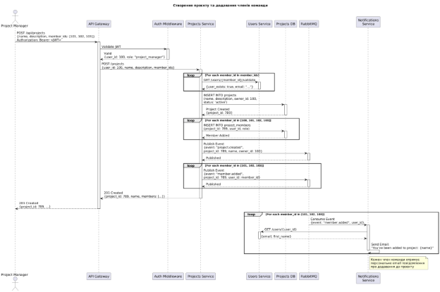
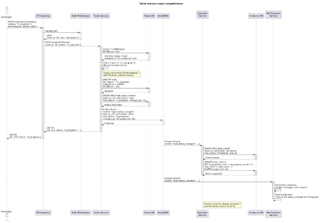
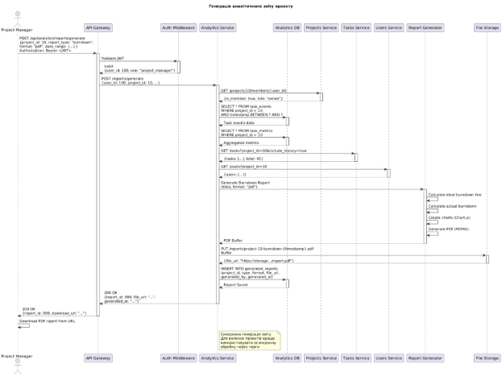
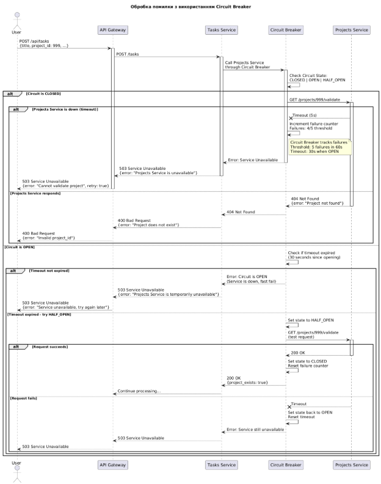

**КИЇВСЬКИЙ НАЦІОНАЛЬНИЙ УНІВЕРСИТЕТ\
БУДІВНИЦТВА ТА АРХІТЕКТУРИ**\
\
\
Кафедра інформаційних технологій\
\
\
\
\
\
**ЛАБОРАТОРНА РОБОТА 1**\
\
з дисципліни

\
**"Архітектура розподілених програмних систем"**\
\
на тему:\
\
**"** **Моделювання взаємодії сервісів"**\
\
\

**\
\
\
\

**\
\

Виконав: студент групи ІПЗм(д)-25\
Постановський Ігор Анатолійович\
\
Перевірив: Мазуренко Р.В.

Київ – 2025
# **Звіт з лабораторної роботи №1**
**Дисципліна:** Архітектура розподілених програмних систем 
## **Мета роботи**
Набути практичних навичок моделювання взаємодії між мікросервісами розподіленої системи, вивчити типи комунікації (синхронна та асинхронна), створити діаграми послідовності для ключових бізнес-сценаріїв та визначити формати повідомлень.
## **Завдання**
1. Проаналізувати типи взаємодії між мікросервісами системи TaskFlow
1. Визначити синхронні та асинхронні канали комунікації
1. Створити діаграми послідовності для ключових бізнес-процесів
1. Описати формати повідомлень (REST API, RabbitMQ Events)
1. Змоделювати обробку помилок та механізми повторних спроб
1. Відповісти на контрольні питання
## **1. Теоретичні відомості**
### **1.1 Типи взаємодії мікросервісів**
У розподілених системах існують два основні типи взаємодії між сервісами:
#### ***Синхронна взаємодія (Synchronous Communication)***
- **Опис:** Клієнт надсилає запит і чекає на відповідь від сервера
- **Протоколи:** REST API (HTTP/HTTPS), gRPC, GraphQL
- **Переваги:**
  - Простота реалізації
  - Зрозуміла семантика виклику
  - Негайна відповідь
- **Недоліки:**
  - Блокуюча операція (клієнт чекає)
  - Сервіс-споживач залежить від доступності сервісу-постачальника
  - Складність у обробці часткових відмов
#### ***Асинхронна взаємодія (Asynchronous Communication)***
- **Опис:** Клієнт надсилає повідомлення і не чекає на миттєву відповідь
- **Протоколи:** Message Brokers (RabbitMQ, Kafka, NATS), Event Sourcing, CQRS
- **Переваги:**
  - Розв’язування залежностей (loose coupling)
  - Висока стійкість до відмов
  - Можливість обробки великого навантаження
- **Недоліки:**
  - Складність у налагодженні
  - Необхідність управління порядком повідомлень
  - Eventual consistency
### **1.2 Патерни взаємодії**
#### ***Request-Response (Запит-Відповідь)***
- Синхронний виклик між сервісами через REST API
- Клієнт чекає на результат
#### ***Event-Driven (Керований подіями)***
- Сервіси публікують події в message broker
- Інші сервіси підписуються на ці події
- Weak coupling між сервісами
#### ***Saga Pattern***
- Координація розподілених транзакцій
- Два типи: Choreography (хореографія) та Orchestration (оркестрація)
#### ***Circuit Breaker***
- Захист від каскадних відмов
- Автоматичне відключення недоступних сервісів
## **2. Аналіз взаємодії сервісів системи TaskFlow**
### **2.1 Карта взаємодій**

|Сервіс від|Сервіс до|Тип взаємодії|Протокол|Призначення|
| :- | :- | :- | :- | :- |
|API Gateway|Users Service|Синхронна|REST/HTTP|Маршрутизація запитів|
|API Gateway|Projects Service|Синхронна|REST/HTTP|Маршрутизація запитів|
|API Gateway|Tasks Service|Синхронна|REST/HTTP|Маршрутизація запитів|
|API Gateway|Notifications Service|Синхронна|REST/HTTP|Маршрутизація запитів|
|API Gateway|Analytics Service|Синхронна|REST/HTTP|Маршрутизація запитів|
|Projects Service|Users Service|Синхронна|REST/HTTP|Валідація користувачів|
|Tasks Service|Projects Service|Синхронна|REST/HTTP|Валідація проєктів|
|Tasks Service|Users Service|Синхронна|REST/HTTP|Валідація користувачів|
|Tasks Service|File Storage|Синхронна|S3 API|Завантаження файлів|
|Users Service|RabbitMQ|Асинхронна|AMQP|Публікація подій (user.registered)|
|Projects Service|RabbitMQ|Асинхронна|AMQP|Публікація подій (project.created)|
|Tasks Service|RabbitMQ|Асинхронна|AMQP|Публікація подій (task.created, task.assigned)|
|RabbitMQ|Notifications Service|Асинхронна|AMQP|Підписка на події|
|RabbitMQ|Analytics Service|Асинхронна|AMQP|Підписка на події|
|Notifications Service|Users Service|Синхронна|REST/HTTP|Отримання інформації про користувача|
|Notifications Service|SMTP Server|Синхронна|SMTP|Відправка email|
|Analytics Service|Users Service|Синхронна|REST/HTTP|Отримання даних користувачів|
|Analytics Service|Projects Service|Синхронна|REST/HTTP|Отримання даних проєктів|
|Analytics Service|Tasks Service|Синхронна|REST/HTTP|Отримання даних задач|
### **2.2 Синхронна взаємодія**
**Використовується для:** - Валідація даних (перевірка існування користувача, проєкту) - CRUD операції з негайним результатом - Отримання даних для генерації звітів - Аутентифікація та авторизація

**Приклад:** При створенні задачі Tasks Service синхронно викликає Projects Service для перевірки, чи існує проєкт.
### **2.3 Асинхронна взаємодія**
**Використовується для:** - Відправка нотифікацій (email, push) - Збір аналітичних даних - Логування подій - Обробка довготривалих операцій

**Приклад:** Після створення задачі Tasks Service публікує подію task.created в RabbitMQ, яку споживає Notifications Service для відправки email.
## **3. Діаграми послідовності**
### **3.1 Сценарій 1: Реєстрація користувача**
![ref1]\
title Реєстрація користувача та відправка email підтвердження\
\
actor "User" as User\
participant "API Gateway" as Gateway\
participant "Users Service" as Users\
participant "Users DB" as UsersDB\
participant "RabbitMQ" as MQ\
participant "Notifications\nService" as Notifications\
participant "Notifications DB" as NotifDB\
participant "Email Sender" as Email\
participant "SMTP Server" as SMTP\
\
User -> Gateway: POST /api/auth/register\n{email, password, first\_name, last\_name}\
activate Gateway\
\
Gateway -> Users: POST /auth/register\
activate Users\
\
' Check if email already exists\
Users -> UsersDB: SELECT \* FROM users\nWHERE email = ?\
activate UsersDB\
UsersDB --> Users: No user found\
deactivate UsersDB\
\
' Hash password\
Users -> Users: bcrypt.hash(password, 10)\
\
' Create user\
Users -> UsersDB: INSERT INTO users\n(email, password\_hash, first\_name, last\_name,\nis\_verified=false)\
activate UsersDB\
UsersDB --> Users: User Created\n{user\_id: 456}\
deactivate UsersDB\
\
' Generate verification token\
Users -> Users: jwt.sign({user\_id, email}, secret,\n{expiresIn: '24h'})\
\
Users -> UsersDB: INSERT INTO email\_verifications\n(user\_id, token, expires\_at)\
activate UsersDB\
UsersDB --> Users: Token Saved\
deactivate UsersDB\
\
' Publish event\
Users -> MQ: Publish Event\n{event: "user.registered",\nuser\_id: 456, email, first\_name,\nverification\_token}\
activate MQ\
MQ --> Users: Event Published\
deactivate MQ\
\
Users --> Gateway: 201 Created\n{user\_id: 456, email, is\_verified: false}\
deactivate Users\
\
Gateway --> User: 201 Created\n{user\_id: 456, message: "Check your email"}\
deactivate Gateway\
\
' Asynchronous notification\
MQ -> Notifications: Consume Event\n{event: "user.registered", ...}\
activate Notifications\
\
Notifications -> NotifDB: INSERT INTO notifications\n(user\_id, type: 'email\_verification', ...)\
activate NotifDB\
NotifDB --> Notifications: Stored\
deactivate NotifDB\
\
Notifications -> Email: Send Verification Email\n(to: email, token: ...)\
activate Email\
\
Email -> SMTP: SMTP Send\n(subject: "Verify your email",\nbody: "Click link: .../verify?token=...")\
activate SMTP\
SMTP --> Email: Email Sent\
deactivate SMTP\
\
Email --> Notifications: Email Delivered\
deactivate Email\
\
Notifications -> NotifDB: UPDATE notifications\nSET sent\_at = NOW()\
activate NotifDB\
NotifDB --> Notifications: Updated\
deactivate NotifDB\
\
deactivate Notifications\
\
note right of MQ\
`  `Асинхронна обробка\
`  `Users Service не чекає\
`  `на відправку email\
end note\
\
@enduml

![ref1]

**Опис:** 1. Користувач надсилає дані реєстрації через API Gateway 2. Users Service перевіряє, чи не зайнятий email 3. Створюється новий користувач з хешованим паролем (bcrypt) 4. Генерується JWT токен для верифікації email 5. Публікується подія user.registered в RabbitMQ 6. Users Service повертає відповідь користувачу (не чекаючи на email) 7. Notifications Service споживає подію та відправляє email через SMTP

**Тип взаємодії:** Комбінована (синхронна для створення користувача, асинхронна для відправки email)
### **3.2 Сценарій 2: Створення проєкту з додаванням членів команди**
@startuml CreateProject\_Sequence\
\
title Створення проєкту та додавання членів команди\
\
actor "Project Manager" as PM\
participant "API Gateway" as Gateway\
participant "Auth Middleware" as Auth\
participant "Projects Service" as Projects\
participant "Users Service" as Users\
participant "Projects DB" as ProjectsDB\
participant "RabbitMQ" as MQ\
participant "Notifications\nService" as Notifications\
\
PM -> Gateway: POST /api/projects\n{name, description, member\_ids: [101, 102, 103]}\nAuthorization: Bearer <JWT>\
activate Gateway\
\
Gateway -> Auth: Validate JWT\
activate Auth\
Auth --> Gateway: Valid\n{user\_id: 100, role: "project\_manager"}\
deactivate Auth\
\
Gateway -> Projects: POST /projects\n{user\_id: 100, name, description, member\_ids}\
activate Projects\
\
' Validate all members exist\
loop For each member\_id in member\_ids\
`    `Projects -> Users: GET /users/{member\_id}/validate\
`    `activate Users\
`    `Users --> Projects: {user\_exists: true, email: "..."}\
`    `deactivate Users\
end\
\
' Create project\
Projects -> ProjectsDB: INSERT INTO projects\n(name, description, owner\_id: 100,\nstatus: 'active')\
activate ProjectsDB\
ProjectsDB --> Projects: Project Created\n{project\_id: 789}\
deactivate ProjectsDB\
\
' Add project members\
loop For each member\_id in [100, 101, 102, 103]\
`    `Projects -> ProjectsDB: INSERT INTO project\_members\n(project\_id: 789, user\_id, role)\
`    `activate ProjectsDB\
`    `ProjectsDB --> Projects: Member Added\
`    `deactivate ProjectsDB\
end\
\
' Publish events\
Projects -> MQ: Publish Event\n{event: "project.created",\nproject\_id: 789, name, owner\_id: 100}\
activate MQ\
MQ --> Projects: Published\
deactivate MQ\
\
loop For each member\_id in [101, 102, 103]\
`    `Projects -> MQ: Publish Event\n{event: "member.added",\nproject\_id: 789, user\_id: member\_id}\
`    `activate MQ\
`    `MQ --> Projects: Published\
`    `deactivate MQ\
end\
\
Projects --> Gateway: 201 Created\n{project\_id: 789, name, members: [...]}\
deactivate Projects\
\
Gateway --> PM: 201 Created\n{project\_id: 789, ...}\
deactivate Gateway\
\
' Asynchronous notifications to members\
loop For each member\_id in [101, 102, 103]\
`    `MQ -> Notifications: Consume Event\n{event: "member.added", user\_id}\
`    `activate Notifications\
\
`    `Notifications -> Users: GET /users/{user\_id}\
`    `activate Users\
`    `Users --> Notifications: {email, first\_name}\
`    `deactivate Users\
\
`    `Notifications -> Notifications: Send Email:\n"You've been added to project: {name}"\
\
`    `deactivate Notifications\
end\
\
note right of Notifications\
`  `Кожен член команди отримує\
`  `персональне email повідомлення\
`  `про додавання до проєкту\
end note\
\
@enduml

**Опис:** 1. Project Manager створює проєкт з переліком членів команди 2. API Gateway перевіряє JWT токен 3. Projects Service валідує кожного члена команди через Users Service (синхронно) 4. Створюється проєкт і додаються члени команди в БД 5. Публікуються події project.created та member.added для кожного члена 6. Projects Service повертає відповідь 7. Notifications Service асинхронно відправляє email кожному члену команди

**Тип взаємодії:** Комбінована
### **3.3 Сценарій 3: Зміна статусу задачі з відправкою нотифікації**
@startuml TaskStatusUpdate\_Sequence\
\
title Зміна статусу задачі розробником\
\
actor "Developer" as Dev\
participant "API Gateway" as Gateway\
participant "Auth Middleware" as Auth\
participant "Tasks Service" as Tasks\
participant "Tasks DB" as TasksDB\
participant "RabbitMQ" as MQ\
participant "Analytics\nService" as Analytics\
participant "Analytics DB" as AnalyticsDB\
participant "Notifications\nService" as Notifications\
\
Dev -> Gateway: PATCH /api/tasks/123/status\n{status: "in\_progress"}\nAuthorization: Bearer <JWT>\
activate Gateway\
\
Gateway -> Auth: Validate JWT\
activate Auth\
Auth --> Gateway: Valid\n{user\_id: 50, role: "developer"}\
deactivate Auth\
\
Gateway -> Tasks: PATCH /tasks/123/status\n{user\_id: 50, status: "in\_progress"}\
activate Tasks\
\
' Get current task\
Tasks -> TasksDB: SELECT \* FROM tasks\nWHERE id = 123\
activate TasksDB\
TasksDB --> Tasks: {id: 123, status: "new",\nassigned\_to: 50, project\_id: 10}\
deactivate TasksDB\
\
' Check permissions\
Tasks -> Tasks: Check if user\_id == assigned\_to\nOR user has permission\
note right of Tasks\
`  `Тільки призначений виконавець\
`  `або PM може змінити статус\
end note\
\
' Update status\
Tasks -> TasksDB: UPDATE tasks\nSET status = 'in\_progress',\nupdated\_at = NOW()\nWHERE id = 123\
activate TasksDB\
TasksDB --> Tasks: Updated\
deactivate TasksDB\
\
' Record status history\
Tasks -> TasksDB: INSERT INTO task\_status\_history\n(task\_id: 123, old\_status: 'new',\nnew\_status: 'in\_progress', changed\_by: 50)\
activate TasksDB\
TasksDB --> Tasks: History Recorded\
deactivate TasksDB\
\
' Publish event\
Tasks -> MQ: Publish Event\n{event: "task.status\_changed",\ntask\_id: 123, old\_status: "new",\nnew\_status: "in\_progress",\nchanged\_by: 50, project\_id: 10}\
activate MQ\
MQ --> Tasks: Published\
deactivate MQ\
\
Tasks --> Gateway: 200 OK\n{id: 123, status: "in\_progress", ...}\
deactivate Tasks\
\
Gateway --> Dev: 200 OK\n{id: 123, status: "in\_progress"}\
deactivate Gateway\
\
' Analytics Service consumes event\
MQ -> Analytics: Consume Event\n{event: "task.status\_changed", ...}\
activate Analytics\
\
Analytics -> AnalyticsDB: INSERT INTO task\_events\n(task\_id, event\_type, old\_status,\nnew\_status, timestamp, user\_id)\
activate AnalyticsDB\
AnalyticsDB --> Analytics: Event Stored\
deactivate AnalyticsDB\
\
Analytics -> AnalyticsDB: UPDATE task\_metrics\nSET in\_progress\_count = in\_progress\_count + 1,\nnew\_count = new\_count - 1\nWHERE project\_id = 10\
activate AnalyticsDB\
AnalyticsDB --> Analytics: Metrics Updated\
deactivate AnalyticsDB\
\
deactivate Analytics\
\
' Notifications Service consumes event\
MQ -> Notifications: Consume Event\n{event: "task.status\_changed", ...}\
activate Notifications\
\
Notifications -> Notifications: Determine recipients\n(project manager, task creator)\
\
Notifications -> Notifications: Send notification:\n"Task #123 status changed to In Progress"\
\
deactivate Notifications\
\
note right of Analytics\
`  `Analytics Service збирає метрики\
`  `для burndown charts та звітів\
end note\
\
@enduml

**Опис:** 1. Розробник змінює статус задачі через API 2. Tasks Service перевіряє права доступу (чи призначена задача цьому користувачу) 3. Оновлюється статус в БД та записується історія змін 4. Публікується подія task.status\_changed 5. Analytics Service споживає подію та оновлює метрики для звітів 6. Notifications Service відправляє нотифікацію менеджеру проєкту

**Тип взаємодії:** Комбінована (синхронна для оновлення, асинхронна для аналітики)
### **3.4 Сценарій 4: Генерація аналітичного звіту**
@startuml GenerateReport\_Sequence\
\
title Генерація аналітичного звіту проєкту\
\
actor "Project Manager" as PM\
participant "API Gateway" as Gateway\
participant "Auth Middleware" as Auth\
participant "Analytics Service" as Analytics\
participant "Analytics DB" as AnalyticsDB\
participant "Projects Service" as Projects\
participant "Tasks Service" as Tasks\
participant "Users Service" as Users\
participant "Report Generator" as ReportGen\
participant "File Storage" as Storage\
\
PM -> Gateway: POST /api/analytics/reports/generate\n{project\_id: 10, report\_type: "burndown",\nformat: "pdf", date\_range: {...}}\nAuthorization: Bearer <JWT>\
activate Gateway\
\
Gateway -> Auth: Validate JWT\
activate Auth\
Auth --> Gateway: Valid\n{user\_id: 100, role: "project\_manager"}\
deactivate Auth\
\
Gateway -> Analytics: POST /reports/generate\n{user\_id: 100, project\_id: 10, ...}\
activate Analytics\
\
' Verify user has access to project\
Analytics -> Projects: GET /projects/10/members/{user\_id}\
activate Projects\
Projects --> Analytics: {is\_member: true, role: "owner"}\
deactivate Projects\
\
' Collect data from Analytics DB\
Analytics -> AnalyticsDB: SELECT \* FROM task\_events\nWHERE project\_id = 10\nAND timestamp BETWEEN ? AND ?\
activate AnalyticsDB\
AnalyticsDB --> Analytics: Task events data\
deactivate AnalyticsDB\
\
Analytics -> AnalyticsDB: SELECT \* FROM task\_metrics\nWHERE project\_id = 10\
activate AnalyticsDB\
AnalyticsDB --> Analytics: Aggregated metrics\
deactivate AnalyticsDB\
\
' Get additional data from other services\
Analytics -> Tasks: GET /tasks?project\_id=10&include\_history=true\
activate Tasks\
Tasks --> Analytics: {tasks: [...], total: 45}\
deactivate Tasks\
\
Analytics -> Users: GET /users?project\_id=10\
activate Users\
Users --> Analytics: {users: [...]}\
deactivate Users\
\
' Generate report\
Analytics -> ReportGen: Generate Burndown Report\n(data, format: "pdf")\
activate ReportGen\
\
ReportGen -> ReportGen: Calculate ideal burndown line\
ReportGen -> ReportGen: Calculate actual burndown\
ReportGen -> ReportGen: Create charts (Chart.js)\
ReportGen -> ReportGen: Generate PDF (PDFKit)\
\
ReportGen --> Analytics: PDF Buffer\
deactivate ReportGen\
\
' Upload to file storage\
Analytics -> Storage: PUT /reports/project-10-burndown-{timestamp}.pdf\nBuffer\
activate Storage\
Storage --> Analytics: {file\_url: "https://storage.../report.pdf"}\
deactivate Storage\
\
' Save report metadata\
Analytics -> AnalyticsDB: INSERT INTO generated\_reports\n(project\_id, type, format, file\_url,\ngenerated\_by, generated\_at)\
activate AnalyticsDB\
AnalyticsDB --> Analytics: Report Saved\
deactivate AnalyticsDB\
\
Analytics --> Gateway: 200 OK\n{report\_id: 999, file\_url: "...",\ngenerated\_at: "..."}\
deactivate Analytics\
\
Gateway --> PM: 200 OK\n{report\_id: 999, download\_url: "..."}\
deactivate Gateway\
\
PM -> PM: Download PDF report from URL\
\
note right of Analytics\
`  `Синхронна генерація звіту\
`  `Для великих проєктів краще\
`  `використовувати асинхронну\
`  `обробку через черги\
end note\
\
@enduml

**Опис:** 1. Project Manager запитує генерацію звіту burndown 2. Analytics Service перевіряє доступ до проєкту 3. Збирається аналітична інформація з Analytics DB 4. Отримуються додаткові дані від Tasks Service та Users Service 5. Report Generator створює PDF звіт з графіками 6. Звіт завантажується в File Storage (S3) 7. Повертається URL для завантаження звіту

**Тип взаємодії:** Синхронна (з можливістю оптимізації через асинхронну обробку)
### **3.5 Сценарій 5: Обробка помилки при валідації (Circuit Breaker)**
@startuml ErrorHandling\_CircuitBreaker\
\
title Обробка помилки з використанням Circuit Breaker\
\
actor "User" as User\
participant "API Gateway" as Gateway\
participant "Tasks Service" as Tasks\
participant "Circuit Breaker" as CB\
participant "Projects Service" as Projects\
\
User -> Gateway: POST /api/tasks\n{title, project\_id: 999, ...}\
activate Gateway\
\
Gateway -> Tasks: POST /tasks\
activate Tasks\
\
' Circuit Breaker checks state\
Tasks -> CB: Call Projects Service\nthrough Circuit Breaker\
activate CB\
\
CB -> CB: Check Circuit State:\nCLOSED | OPEN | HALF\_OPEN\
\
alt Circuit is CLOSED\
`    `CB -> Projects: GET /projects/999/validate\
`    `activate Projects\
\
`    `alt Projects Service is down (timeout)\
`        `Projects --x CB: Timeout (5s)\
\
`        `CB -> CB: Increment failure counter\nFailures: 4/5 threshold\
\
`        `note right of CB\
`          `Circuit Breaker tracks failures\
`          `Threshold: 5 failures in 60s\
`          `Timeout: 30s when OPEN\
`        `end note\
\
`        `CB --> Tasks: Error: Service Unavailable\
`        `deactivate CB\
\
`        `Tasks --> Gateway: 503 Service Unavailable\n{error: "Projects Service is unavailable"}\
`        `deactivate Tasks\
\
`        `Gateway --> User: 503 Service Unavailable\n{error: "Cannot validate project", retry: true}\
`        `deactivate Gateway\
\
`    `else Projects Service responds\
`        `Projects --> CB: 404 Not Found\n{error: "Project not found"}\
`        `deactivate Projects\
\
`        `CB --> Tasks: 404 Not Found\
`        `deactivate CB\
\
`        `Tasks --> Gateway: 400 Bad Request\n{error: "Project does not exist"}\
`        `deactivate Tasks\
\
`        `Gateway --> User: 400 Bad Request\n{error: "Invalid project\_id"}\
`        `deactivate Gateway\
`    `end\
\
else Circuit is OPEN\
`    `CB -> CB: Check if timeout expired\n(30 seconds since opening)\
\
`    `alt Timeout not expired\
`        `CB --> Tasks: Error: Circuit is OPEN\n(Service is down, fast fail)\
`        `deactivate CB\
\
`        `Tasks --> Gateway: 503 Service Unavailable\n{error: "Projects Service is temporarily unavailable"}\
`        `deactivate Tasks\
\
`        `Gateway --> User: 503 Service Unavailable\n{error: "Service unavailable, try again later"}\
`        `deactivate Gateway\
\
`    `else Timeout expired - try HALF\_OPEN\
`        `CB -> CB: Set state to HALF\_OPEN\
\
`        `CB -> Projects: GET /projects/999/validate\n(test request)\
`        `activate Projects\
\
`        `alt Request succeeds\
`            `Projects --> CB: 200 OK\
`            `deactivate Projects\
\
`            `CB -> CB: Set state to CLOSED\nReset failure counter\
\
`            `CB --> Tasks: 200 OK\n{project\_exists: true}\
`            `deactivate CB\
\
`            `Tasks --> Gateway: Continue processing...\
`            `deactivate Tasks\
\
`        `else Request fails\
`            `Projects --x CB: Timeout\
`            `deactivate Projects\
\
`            `CB -> CB: Set state back to OPEN\nReset timeout\
\
`            `CB --> Tasks: Error: Service still unavailable\
`            `deactivate CB\
\
`            `Tasks --> Gateway: 503 Service Unavailable\
`            `deactivate Tasks\
\
`            `Gateway --> User: 503 Service Unavailable\
`            `deactivate Gateway\
`        `end\
`    `end\
end\
\
@enduml

**Опис Circuit Breaker Pattern:**

1. **Стан CLOSED (Закритий):**
   - Всі запити проходять до Projects Service
   - Відстежуються помилки (timeout, 5xx)
   - При досягненні порогу (5 помилок за 60с) → перехід в OPEN
1. **Стан OPEN (Відкритий):**
   - Запити до Projects Service блокуються (fail fast)
   - Відразу повертається помилка 503
   - Таймаут 30 секунд → перехід в HALF\_OPEN
1. **Стан HALF\_OPEN (Напівзакритий):**
   - Дозволяється тестовий запит до Projects Service
   - Якщо успішно → CLOSED (сервіс відновився)
   - Якщо помилка → OPEN (сервіс все ще недоступний)

**Переваги:** - Захист від каскадних відмов - Швидке повідомлення про недоступність сервісу - Автоматичне відновлення при виправленні проблеми
## **4. Формати повідомлень**
### **4.1 REST API Request/Response**
#### ***POST /api/auth/register***
**Request:**

{\
`  `"email": "john.doe@example.com",\
`  `"password": "SecurePass123!",\
`  `"first\_name": "John",\
`  `"last\_name": "Doe"\
}

**Response (201 Created):**

{\
`  `"user\_id": 456,\
`  `"email": "john.doe@example.com",\
`  `"first\_name": "John",\
`  `"last\_name": "Doe",\
`  `"is\_verified": **false**,\
`  `"created\_at": "2025-12-18T10:30:00Z",\
`  `"message": "Registration successful. Please check your email to verify your account."\
}

**Response (400 Bad Request):**

{\
`  `"error": "Email already exists",\
`  `"code": "EMAIL\_DUPLICATE",\
`  `"field": "email"\
}

-----
#### ***POST /api/tasks***
**Request:**

{\
`  `"title": "Implement user authentication",\
`  `"description": "Add JWT-based authentication to the API",\
`  `"project\_id": 10,\
`  `"assigned\_to": 50,\
`  `"priority": "high",\
`  `"deadline": "2025-12-25T23:59:59Z",\
`  `"tags": ["backend", "security"]\
}

**Response (201 Created):**

{\
`  `"task\_id": 123,\
`  `"title": "Implement user authentication",\
`  `"description": "Add JWT-based authentication to the API",\
`  `"project\_id": 10,\
`  `"assigned\_to": 50,\
`  `"created\_by": 100,\
`  `"status": "new",\
`  `"priority": "high",\
`  `"deadline": "2025-12-25T23:59:59Z",\
`  `"tags": ["backend", "security"],\
`  `"created\_at": "2025-12-18T10:35:00Z",\
`  `"updated\_at": "2025-12-18T10:35:00Z"\
}

-----
#### ***PATCH /api/tasks/123/status***
**Request:**

{\
`  `"status": "in\_progress"\
}

**Response (200 OK):**

{\
`  `"task\_id": 123,\
`  `"status": "in\_progress",\
`  `"updated\_at": "2025-12-18T11:00:00Z",\
`  `"status\_changed\_by": 50\
}
### **4.2 RabbitMQ Events**
#### ***Event: user.registered***
**Exchange:** taskflow.events **Routing Key:** user.registered **Queue:** notifications.user.registered

**Payload:**

{\
`  `"event": "user.registered",\
`  `"timestamp": "2025-12-18T10:30:00Z",\
`  `"data": {\
`    `"user\_id": 456,\
`    `"email": "john.doe@example.com",\
`    `"first\_name": "John",\
`    `"last\_name": "Doe",\
`    `"verification\_token": "eyJhbGciOiJIUzI1NiIsInR5cCI6IkpXVCJ9...",\
`    `"verification\_url": "https://taskflow.com/verify?token=..."\
`  `}\
}

**Subscribers:** - Notifications Service (для відправки verification email) - Analytics Service (для метрики “New Users”)
#### ***Event: task.created***
**Exchange:** taskflow.events **Routing Key:** task.created **Queues:** notifications.task.created, analytics.task.created

**Payload:**

{\
`  `"event": "task.created",\
`  `"timestamp": "2025-12-18T10:35:00Z",\
`  `"data": {\
`    `"task\_id": 123,\
`    `"title": "Implement user authentication",\
`    `"project\_id": 10,\
`    `"project\_name": "TaskFlow Platform",\
`    `"created\_by": 100,\
`    `"assigned\_to": 50,\
`    `"priority": "high",\
`    `"deadline": "2025-12-25T23:59:59Z"\
`  `}\
}

**Subscribers:** - Notifications Service (відправка email призначеному розробнику) - Analytics Service (збір метрик по задачах)
#### ***Event: task.status\_changed***
**Exchange:** taskflow.events **Routing Key:** task.status\_changed

**Payload:**

{\
`  `"event": "task.status\_changed",\
`  `"timestamp": "2025-12-18T11:00:00Z",\
`  `"data": {\
`    `"task\_id": 123,\
`    `"old\_status": "new",\
`    `"new\_status": "in\_progress",\
`    `"changed\_by": 50,\
`    `"project\_id": 10\
`  `}\
}

**Subscribers:** - Notifications Service (нотифікація менеджера проєкту) - Analytics Service (оновлення метрик для burndown chart)
#### ***Event: project.created***
**Exchange:** taskflow.events **Routing Key:** project.created

**Payload:**

{\
`  `"event": "project.created",\
`  `"timestamp": "2025-12-18T09:00:00Z",\
`  `"data": {\
`    `"project\_id": 789,\
`    `"name": "TaskFlow Platform",\
`    `"description": "Project management system",\
`    `"owner\_id": 100,\
`    `"status": "active",\
`    `"start\_date": "2025-12-18",\
`    `"deadline": "2026-06-30"\
`  `}\
}

**Subscribers:** - Analytics Service (створення аналітичної структури для проєкту)
#### ***Event: member.added***
**Exchange:** taskflow.events **Routing Key:** member.added

**Payload:**

{\
`  `"event": "member.added",\
`  `"timestamp": "2025-12-18T09:01:00Z",\
`  `"data": {\
`    `"project\_id": 789,\
`    `"project\_name": "TaskFlow Platform",\
`    `"user\_id": 101,\
`    `"role": "developer",\
`    `"added\_by": 100\
`  `}\
}

**Subscribers:** - Notifications Service (відправка email новому члену команди)
### **4.3 Конфігурація RabbitMQ**
#### ***Exchanges:***
*// Topic Exchange для всіх подій системи*\
{\
`  `name: 'taskflow.events',\
`  `type: 'topic',\
`  `durable: **true**,\
`  `autoDelete: **false**\
}
#### ***Queues та Bindings:***
*// Queue для Notifications Service*\
{\
`  `queue: 'notifications.user.registered',\
`  `exchange: 'taskflow.events',\
`  `routingKey: 'user.registered',\
`  `durable: **true**,\
`  `deadLetterExchange: 'taskflow.dlx'\
}\
\
{\
`  `queue: 'notifications.task.created',\
`  `exchange: 'taskflow.events',\
`  `routingKey: 'task.created',\
`  `durable: **true**\
}\
\
{\
`  `queue: 'notifications.task.status\_changed',\
`  `exchange: 'taskflow.events',\
`  `routingKey: 'task.status\_changed',\
`  `durable: **true**\
}\
\
{\
`  `queue: 'notifications.member.added',\
`  `exchange: 'taskflow.events',\
`  `routingKey: 'member.added',\
`  `durable: **true**\
}\
\
*// Queues для Analytics Service*\
{\
`  `queue: 'analytics.task.created',\
`  `exchange: 'taskflow.events',\
`  `routingKey: 'task.created',\
`  `durable: **true**\
}\
\
{\
`  `queue: 'analytics.task.status\_changed',\
`  `exchange: 'taskflow.events',\
`  `routingKey: 'task.status\_changed',\
`  `durable: **true**\
}\
\
{\
`  `queue: 'analytics.project.created',\
`  `exchange: 'taskflow.events',\
`  `routingKey: 'project.created',\
`  `durable: **true**\
}
## **5. Обробка помилок та Retry Mechanisms**
### **5.1 Стратегії обробки помилок**
#### ***Синхронна взаємодія (REST API)***
**1. Timeout Configuration:**

**const** axiosConfig = {\
`  `timeout: 5000, *// 5 seconds*\
`  `headers: {\
`    `'Content-Type': 'application/json',\
`    `'Authorization': `Bearer ${token}`\
`  `}\
};

**2. Retry with Exponential Backoff:**

**async** **function** callWithRetry(fn, maxRetries = 3) {\
`  `**let** lastError;\
\
`  `**for** (**let** attempt = 0; attempt < maxRetries; attempt++) {\
`    `**try** {\
`      `**return** **await** fn();\
`    `} **catch** (error) {\
`      `lastError = error;\
\
`      `*// Don't retry on 4xx errors (client errors)*\
`      `**if** (error.response && error.response.status >= 400 && error.response.status < 500) {\
`        `**throw** error;\
`      `}\
\
`      `*// Exponential backoff: 1s, 2s, 4s*\
`      `**const** delay = Math.pow(2, attempt) \* 1000;\
`      `**await** **new** Promise(resolve **=>** setTimeout(resolve, delay));\
`    `}\
`  `}\
\
`  `**throw** lastError;\
}\
\
*// Usage*\
**const** project = **await** callWithRetry(**async** () **=>** {\
`  `**return** **await** axios.get(`${PROJECTS\_SERVICE\_URL}/projects/${projectId}/validate`);\
});

**3. Circuit Breaker Implementation:**

**const** CircuitBreaker = require('opossum');\
\
**const** options = {\
`  `timeout: 5000, *// 5s timeout*\
`  `errorThresholdPercentage: 50, *// Open circuit if 50% of requests fail*\
`  `resetTimeout: 30000, *// Try again after 30s*\
`  `rollingCountTimeout: 60000, *// Rolling window of 60s*\
`  `volumeThreshold: 5 *// Minimum requests before opening circuit*\
};\
\
**const** breaker = **new** CircuitBreaker(callProjectsService, options);\
\
breaker.fallback(() **=>** {\
`  `*// Fallback response when circuit is open*\
`  `**return** {\
`    `available: **false**,\
`    `cached: **true**,\
`    `message: 'Projects Service is currently unavailable'\
`  `};\
});\
\
breaker.on('open', () **=>** {\
`  `console.error('Circuit breaker opened - Projects Service is down');\
});\
\
breaker.on('halfOpen', () **=>** {\
`  `console.log('Circuit breaker half-open - testing Projects Service');\
});\
\
breaker.on('close', () **=>** {\
`  `console.log('Circuit breaker closed - Projects Service is back online');\
});
#### ***Асинхронна взаємодія (RabbitMQ)***
**1. Message Acknowledgment:**

*// Consumer with manual acknowledgment*\
channel.consume(queue, **async** (msg) **=>** {\
`  `**try** {\
`    `**const** event = JSON.parse(msg.content.toString());\
\
`    `*// Process the message*\
`    `**await** processEvent(event);\
\
`    `*// Acknowledge successful processing*\
`    `channel.ack(msg);\
\
`  `} **catch** (error) {\
`    `console.error('Error processing message:', error);\
\
`    `*// Negative acknowledgment - requeue the message*\
`    `channel.nack(msg, **false**, **true**);\
`  `}\
}, {\
`  `noAck: **false** *// Require manual acknowledgment*\
});

**2. Dead Letter Exchange (DLX):**

*// Configure queue with DLX*\
**await** channel.assertQueue('notifications.task.created', {\
`  `durable: **true**,\
`  `deadLetterExchange: 'taskflow.dlx',\
`  `deadLetterRoutingKey: 'failed.notifications.task.created',\
`  `messageTtl: 86400000, *// 24 hours*\
`  `arguments: {\
`    `'x-max-retries': 3\
`  `}\
});\
\
*// Dead Letter Queue for failed messages*\
**await** channel.assertQueue('dlq.notifications.task.created', {\
`  `durable: **true**\
});\
\
**await** channel.bindQueue(\
`  `'dlq.notifications.task.created',\
`  `'taskflow.dlx',\
`  `'failed.notifications.task.created'\
);

**3. Retry with Delayed Queue:**

*// Process message with retry logic*\
channel.consume('notifications.task.created', **async** (msg) **=>** {\
`  `**const** retries = msg.properties.headers['x-retries'] || 0;\
`  `**const** maxRetries = 3;\
\
`  `**try** {\
`    `**const** event = JSON.parse(msg.content.toString());\
`    `**await** sendNotificationEmail(event);\
\
`    `*// Success - acknowledge*\
`    `channel.ack(msg);\
\
`  `} **catch** (error) {\
`    `**if** (retries < maxRetries) {\
`      `*// Retry with delay*\
`      `**const** delay = Math.pow(2, retries) \* 1000; *// Exponential backoff*\
\
`      `setTimeout(() **=>** {\
`        `channel.publish('taskflow.events', 'task.created', msg.content, {\
`          `headers: {\
`            `'x-retries': retries + 1\
`          `}\
`        `});\
`      `}, delay);\
\
`      `*// Acknowledge original message*\
`      `channel.ack(msg);\
\
`    `} **else** {\
`      `*// Max retries reached - send to DLQ*\
`      `channel.nack(msg, **false**, **false**);\
\
`      `console.error(`Message failed after ${maxRetries} retries:`, error);\
`    `}\
`  `}\
});
### **5.2 Idempotency (Ідемпотентність)**
Для забезпечення безпечності повторної обробки повідомлень необхідно реалізувати ідемпотентність:

*// Notifications Service - idempotent email sending*\
**async** **function** sendNotificationEmail(event) {\
`  `**const** { task\_id, assigned\_to, timestamp } = event.data;\
\
`  `*// Generate idempotency key*\
`  `**const** idempotencyKey = `task.created:${task\_id}:${assigned\_to}:${timestamp}`;\
\
`  `*// Check if already processed*\
`  `**const** alreadyProcessed = **await** redis.get(`idempotency:${idempotencyKey}`);\
`  `**if** (alreadyProcessed) {\
`    `console.log(`Event already processed: ${idempotencyKey}`);\
`    `**return**;\
`  `}\
\
`  `*// Process event*\
`  `**await** sendEmail({\
`    `to: assigned\_to,\
`    `subject: 'New task assigned',\
`    `body: `You have been assigned to task #${task\_id}`\
`  `});\
\
`  `*// Mark as processed (TTL 24 hours)*\
`  `**await** redis.setex(`idempotency:${idempotencyKey}`, 86400, 'processed');\
}
### **5.3 Таблиця кодів помилок**

|Код|Назва|Опис|Дія|
| :- | :- | :- | :- |
|400|Bad Request|Некоректні дані в запиті|Перевірити вхідні дані|
|401|Unauthorized|Відсутній або невалідний JWT токен|Авторизуватися знову|
|403|Forbidden|Недостатньо прав доступу|Запитати доступ у адміністратора|
|404|Not Found|Ресурс не знайдено|Перевірити ID ресурсу|
|409|Conflict|Конфлікт даних (наприклад, email вже існує)|Використати інше значення|
|422|Unprocessable Entity|Валідація не пройдена|Виправити дані згідно з помилками|
|429|Too Many Requests|Перевищено ліміт запитів|Зачекати перед повторним запитом|
|500|Internal Server Error|Внутрішня помилка сервера|Повторити запит пізніше|
|502|Bad Gateway|Помилка в upstream service|Перевірити стан залежних сервісів|
|503|Service Unavailable|Сервіс тимчасово недоступний|Спробувати пізніше (Circuit Breaker)|
|504|Gateway Timeout|Timeout при виклику іншого сервісу|Збільшити timeout або оптимізувати|
##
## **6. Висновки**
У ході виконання лабораторної роботи №3 було здійснено моделювання взаємодії між мікросервісами системи TaskFlow. Основні результати:
### **6.1 Досягнуті цілі**
1. **Змодельовано 5 ключових бізнес-сценаріїв:**
   - Реєстрація користувача з email-верифікацією
   - Створення проєкту з додаванням членів команди
   - Зміна статусу задачі з аналітикою
   - Генерація аналітичного звіту
   - Обробка помилок з Circuit Breaker
1. **Визначено типи взаємодії:**
   - **Синхронна** (REST API): для валідації даних, CRUD операцій, отримання інформації
   - **Асинхронна** (RabbitMQ): для нотифікацій, аналітики, логування подій
1. **Описано формати повідомлень:**
   - REST API requests/responses з прикладами JSON
   - RabbitMQ events з routing keys та payloads
   - Конфігурація exchanges, queues, bindings
1. **Реалізовано механізми обробки помилок:**
   - Retry with exponential backoff для синхронних викликів
   - Circuit Breaker для захисту від каскадних відмов
   - Dead Letter Queue для failed messages
   - Idempotency для безпечної повторної обробки
### **6.2 Переваги обраних підходів**
- **Event-Driven Architecture:** Дозволяє слабке зв’язування (loose coupling) між сервісами
- **Circuit Breaker:** Захищає систему від каскадних відмов при падінні одного сервісу
- **Retry Mechanisms:** Підвищують resilience системи до тимчасових збоїв
- **Idempotency:** Забезпечує коректну роботу при повторній обробці повідомлень
### **6.3 Рекомендації для подальшого розвитку**
1. **Saga Pattern:** Для управління розподіленими транзакціями (наприклад, створення проєкту + додавання членів + відправка email)
1. **API Gateway Rate Limiting:** Захист від DDoS та перевантаження
1. **Service Mesh (Istio/Linkerd):** Для управління трафіком, security, observability
1. **Distributed Tracing (Jaeger):** Для відстеження запитів через всі мікросервіси

## **7. Відповіді на контрольні питання**
### **Питання 1: Які основні типи взаємодії існують між мікросервісами?**
**Відповідь:**

Існують два основні типи взаємодії:

1. **Синхронна взаємодія (Synchronous Communication):**
   - Клієнт надсилає запит і чекає на відповідь
   - Протоколи: REST API (HTTP/HTTPS), gRPC, GraphQL
   - Приклад: Tasks Service викликає Projects Service для валідації проєкту
   - Переваги: простота, негайна відповідь, зрозуміла семантика
   - Недоліки: блокуюча операція, залежність від доступності сервісу
1. **Асинхронна взаємодія (Asynchronous Communication):**
   - Клієнт надсилає повідомлення без очікування миттєвої відповіді
   - Протоколи: Message Brokers (RabbitMQ, Kafka), Event Sourcing
   - Приклад: Users Service публікує подію user.registered, яку споживає Notifications Service
   - Переваги: loose coupling, висока стійкість, eventual consistency
   - Недоліки: складність налагодження, необхідність управління порядком повідомлень

**В системі TaskFlow використовуються обидва типи:** - Синхронна для валідації та CRUD операцій - Асинхронна для нотифікацій та аналітики
### **Питання 2: Що таке Circuit Breaker і навіщо він потрібен?**
**Відповідь:**

**Circuit Breaker** - це патерн проектування, що захищає розподілену систему від каскадних відмов при недоступності одного з сервісів.

**Принцип роботи:**

1. **Стан CLOSED (Закритий):**
   - Всі запити проходять до цільового сервісу
   - Відстежуються помилки (timeouts, 5xx responses)
   - При досягненні порогу помилок → перехід в OPEN
1. **Стан OPEN (Відкритий):**
   - Запити до сервісу блокуються (fail fast)
   - Відразу повертається помилка без виклику сервісу
   - Після timeout (наприклад, 30с) → перехід в HALF\_OPEN
1. **Стан HALF\_OPEN (Напівзакритий):**
   - Дозволяється тестовий запит
   - Якщо успішно → CLOSED (сервіс відновився)
   - Якщо помилка → OPEN (сервіс все ще недоступний)

**Переваги:** - Захист від каскадних відмов (якщо сервіс A падає, сервіс B не падає разом з ним) - Швидка відповідь клієнту (fail fast замість очікування timeout) - Автоматичне відновлення при виправленні проблеми - Можливість надати fallback response

**Приклад у TaskFlow:** При створенні задачі Tasks Service перевіряє проєкт через Projects Service. Якщо Projects Service недоступний, Circuit Breaker швидко повертає помилку без блокування Tasks Service.
### **Питання 3: Як забезпечити ідемпотентність при обробці повідомлень?**
**Відповідь:**

**Ідемпотентність** означає, що повторна обробка того самого повідомлення не змінює стан системи і не призводить до дублікатів.

**Методи забезпечення ідемпотентності:**

1. **Idempotency Key:**
   - Генерується унікальний ключ для кожного повідомлення
   - Перед обробкою перевіряється, чи не оброблено вже це повідомлення
   - Використовується Redis або БД для зберігання оброблених ключів

**const** idempotencyKey = `task.created:${task\_id}:${assigned\_to}:${timestamp}`;\
**const** alreadyProcessed = **await** redis.get(`idempotency:${idempotencyKey}`);\
\
**if** (alreadyProcessed) {\
`  `**return**; *// Skip duplicate*\
}\
\
*// Process event*\
**await** sendEmail(...);\
\
*// Mark as processed (TTL 24 hours)*\
**await** redis.setex(`idempotency:${idempotencyKey}`, 86400, 'processed');

2. **Database Constraints:**
   - Використання унікальних індексів в БД
   - При дублюванні виникає помилка, яка обробляється gracefully

**CREATE** **UNIQUE** **INDEX** idx\_notification\_task\_user\
**ON** notifications (task\_id, user\_id, notification\_type);

3. **Event ID Tracking:**
   - Кожна подія має унікальний ID
   - Зберігаються ID оброблених подій в БД
   - Перед обробкою перевіряється наявність event\_id

**const** eventId = event.metadata.event\_id;\
**const** exists = **await** db.query('SELECT 1 FROM processed\_events WHERE event\_id = ?', [eventId]);\
\
**if** (exists) {\
`  `**return**; *// Already processed*\
}\
\
*// Process event*\
**await** handleEvent(event);\
\
*// Store event ID*\
**await** db.query('INSERT INTO processed\_events (event\_id, processed\_at) VALUES (?, NOW())', [eventId]);

4. **Natural Idempotency:**
   - Деякі операції природньо ідемпотентні
   - Приклад: UPDATE users SET status = 'active' WHERE id = 123
   - Повторне виконання не змінює результат

**Важливо:** Ідемпотентність критично важлива для асинхронної обробки через RabbitMQ, оскільки повідомлення можуть бути доставлені більше одного разу (at-least-once delivery).
### **Питання 4: Які стратегії retry слід використовувати при помилках?**
**Відповідь:**

Існують різні стратегії повторних спроб залежно від типу помилки та контексту:

**1. Exponential Backoff (Експоненційна затримка):** - Затримка збільшується експоненційно після кожної невдалої спроби - Приклад: 1s, 2s, 4s, 8s

**const** delay = Math.pow(2, attempt) \* 1000;\
**await** **new** Promise(resolve **=>** setTimeout(resolve, delay));

**Переваги:** Зменшує навантаження на сервіс, що відновлюється

**2. Fixed Delay (Фіксована затримка):** - Однакова затримка між спробами - Приклад: 5s між кожною спробою

**Переваги:** Простота, передбачуваність

**3. Jitter (Випадкове відхилення):** - Додавання випадкової затримки до exponential backoff - Запобігає “thundering herd problem”

**const** delay = (Math.pow(2, attempt) + Math.random()) \* 1000;

**4. Conditional Retry (Умовний retry):** - Retry тільки для певних типів помилок

**if** (error.response && error.response.status >= 400 && error.response.status < 500) {\
`  `*// Client error (4xx) - don't retry*\
`  `**throw** error;\
}\
\
**if** (error.response && error.response.status >= 500) {\
`  `*// Server error (5xx) - retry*\
`  `**return** retry();\
}\
\
**if** (error.code === 'ECONNREFUSED' || error.code === 'ETIMEDOUT') {\
`  `*// Network error - retry*\
`  `**return** retry();\
}

**Коли НЕ використовувати retry:** - 4xx помилки (Bad Request, Unauthorized, Forbidden) - це помилки клієнта - Операції, що не є ідемпотентними (без додаткового захисту) - Критичні операції, де затримка неприйнятна

**Коли використовувати retry:** - 5xx помилки (Internal Server Error, Service Unavailable) - Network timeouts, connection refused - Тимчасові збої (rate limiting з Retry-After header)

**Рекомендації для TaskFlow:** - Синхронні виклики: 3 retry з exponential backoff + jitter - Асинхронні повідомлення: Dead Letter Queue після 3 невдалих спроб - Circuit Breaker: Автоматичне відключення після 5 помилок
### **Питання 5: Як організувати Dead Letter Queue (DLQ)?**
**Відповідь:**

**Dead Letter Queue (DLQ)** - це спеціальна черга для повідомлень, які не вдалося обробити після кількох спроб.

**Конфігурація DLQ в RabbitMQ:**

*// 1. Створення Dead Letter Exchange*\
**await** channel.assertExchange('taskflow.dlx', 'topic', {\
`  `durable: **true**\
});\
\
*// 2. Створення основної черги з параметрами DLX*\
**await** channel.assertQueue('notifications.task.created', {\
`  `durable: **true**,\
`  `deadLetterExchange: 'taskflow.dlx',\
`  `deadLetterRoutingKey: 'failed.notifications.task.created',\
`  `arguments: {\
`    `'x-message-ttl': 86400000, *// 24 hours*\
`    `'x-max-length': 100000 *// Max 100k messages*\
`  `}\
});\
\
*// 3. Створення Dead Letter Queue*\
**await** channel.assertQueue('dlq.notifications.task.created', {\
`  `durable: **true**,\
`  `arguments: {\
`    `'x-message-ttl': 604800000 *// 7 days retention*\
`  `}\
});\
\
*// 4. Binding DLQ до DLX*\
**await** channel.bindQueue(\
`  `'dlq.notifications.task.created',\
`  `'taskflow.dlx',\
`  `'failed.notifications.task.created'\
);

**Обробка повідомлень з retry перед DLQ:**

channel.consume('notifications.task.created', **async** (msg) **=>** {\
`  `**const** retries = msg.properties.headers['x-retries'] || 0;\
`  `**const** maxRetries = 3;\
\
`  `**try** {\
`    `**await** processMessage(msg);\
`    `channel.ack(msg); *// Success*\
\
`  `} **catch** (error) {\
`    `**if** (retries < maxRetries) {\
`      `*// Re-publish with incremented retry counter*\
`      `channel.publish('taskflow.events', 'task.created', msg.content, {\
`        `headers: {\
`          `'x-retries': retries + 1,\
`          `'x-first-death-reason': error.message\
`        `}\
`      `});\
\
`      `channel.ack(msg); *// Remove from original queue*\
\
`    `} **else** {\
`      `*// Max retries exceeded - send to DLQ*\
`      `channel.nack(msg, **false**, **false**);\
\
`      `*// Log failed message*\
`      `**await** logFailedMessage({\
`        `queue: 'notifications.task.created',\
`        `message: msg.content.toString(),\
`        `error: error.message,\
`        `retries: retries\
`      `});\
`    `}\
`  `}\
});

**Моніторинг та обробка DLQ:**

*// Periodic DLQ processor (runs every hour)*\
setInterval(**async** () **=>** {\
`  `**const** dlqMessages = **await** channel.checkQueue('dlq.notifications.task.created');\
\
`  `**if** (dlqMessages.messageCount > 0) {\
`    `console.error(`DLQ has ${dlqMessages.messageCount} failed messages`);\
\
`    `*// Alert operations team*\
`    `**await** sendAlert({\
`      `severity: 'error',\
`      `message: `Dead Letter Queue has ${dlqMessages.messageCount} messages`,\
`      `queue: 'dlq.notifications.task.created'\
`    `});\
`  `}\
}, 3600000); *// Every hour*

**Стратегії обробки DLQ:** 1. **Manual Replay:** Адміністратор вручну перевіряє та повторно публікує повідомлення 2. **Automated Replay:** Автоматична повторна публікація через певний час 3. **Analysis and Fix:** Аналіз причин помилок та виправлення коду 4. **Discard:** Видалення безнадійних повідомлень після закінчення retention period
## **8. Використані матеріали**
1. **Офіційна документація:**
   - RabbitMQ Documentation: https://www.rabbitmq.com/documentation.html
   - Circuit Breaker Pattern: https://martinfowler.com/bliki/CircuitBreaker.html
   - REST API Best Practices
1. **Книги:**
   - “Building Microservices” - Sam Newman
   - “Microservices Patterns” - Chris Richardson
   - “Designing Data-Intensive Applications” - Martin Kleppmann
1. **Статті та блоги:**
   - AWS Architecture Blog
   - Martin Fowler’s Blog on Microservices
   - Microservices.io - Patterns Catalog

[ref1]: Aspose.Words.56eb0a48-d2fc-421d-80b3-498f1a6144d2.001.png
