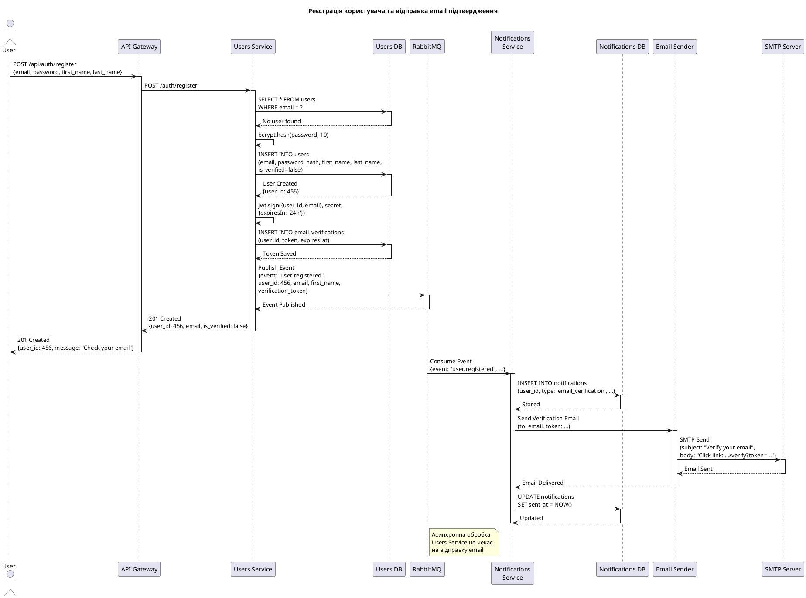
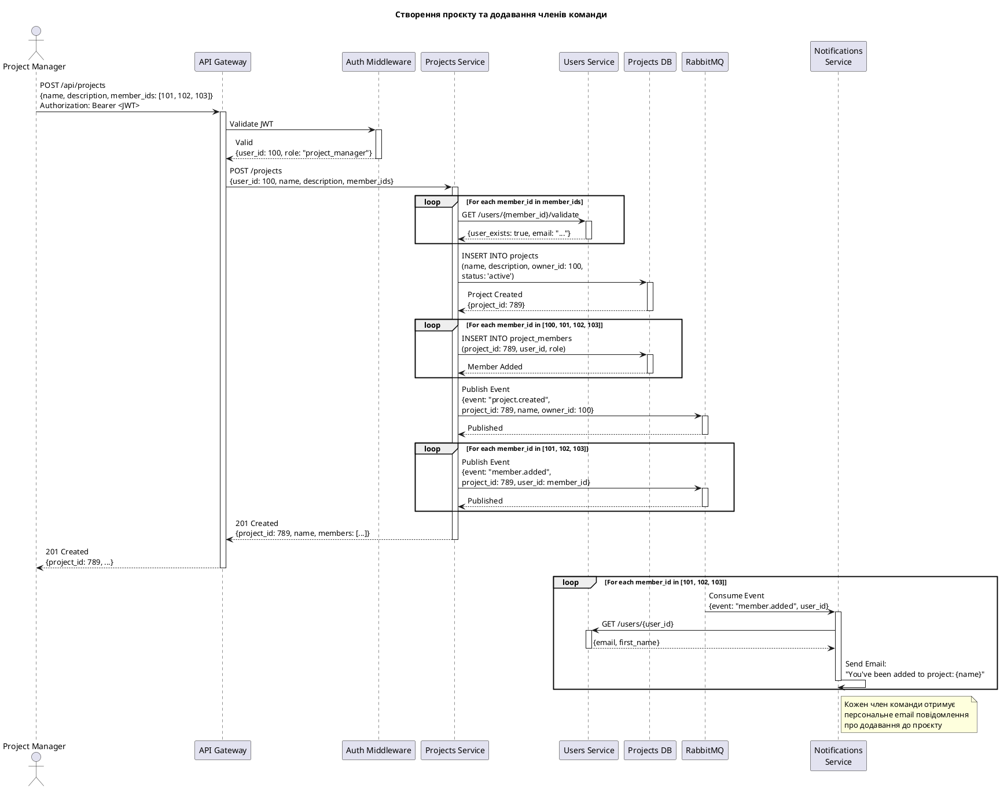
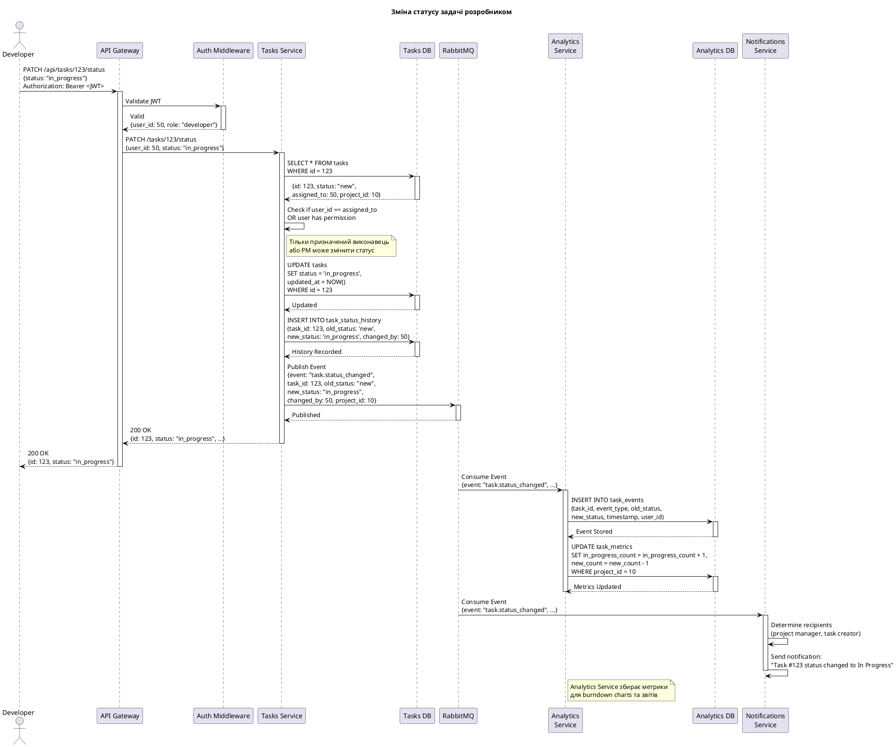
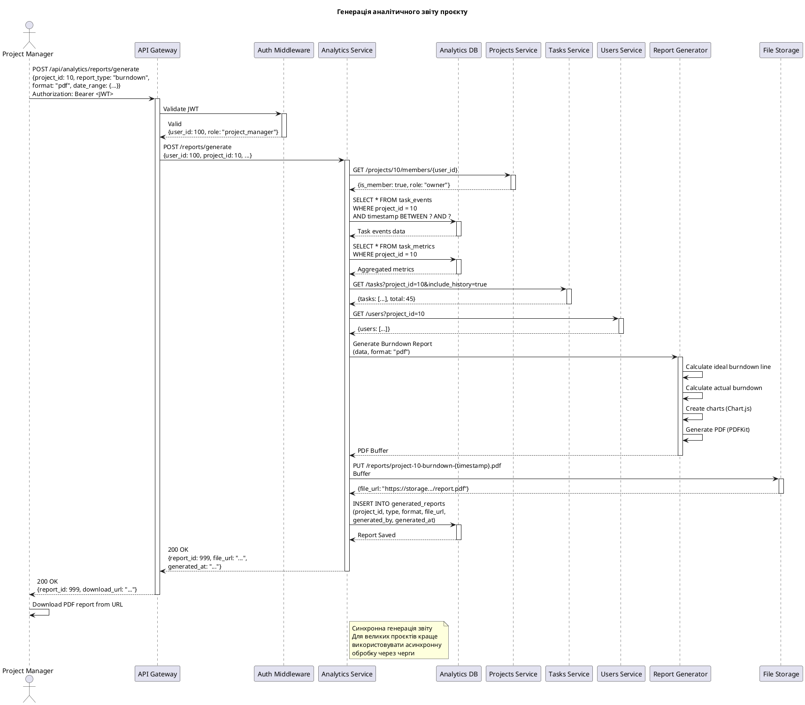
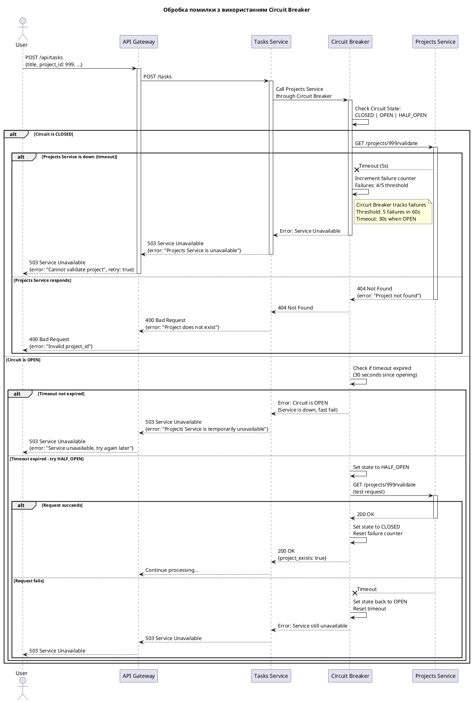

# Лабораторна робота №3: Моделювання взаємодії сервісів

**Дисципліна:** Архітектура розподілених програмних систем
**Студент:** [ПІБ]
**Група:** [Група]
**Дата виконання:** 18.12.2025

---

## Мета роботи

Набути практичних навичок моделювання взаємодії між мікросервісами розподіленої системи, вивчити типи комунікації (синхронна та асинхронна), створити діаграми послідовності для ключових бізнес-сценаріїв та визначити формати повідомлень.

---

## Завдання

1. Проаналізувати типи взаємодії між мікросервісами системи TaskFlow
2. Визначити синхронні та асинхронні канали комунікації
3. Створити діаграми послідовності для ключових бізнес-процесів
4. Описати формати повідомлень (REST API, RabbitMQ Events)
5. Змоделювати обробку помилок та механізми повторних спроб
6. Відповісти на контрольні питання

---

## 1. Теоретичні відомості

### 1.1 Типи взаємодії мікросервісів

У розподілених системах існують два основні типи взаємодії між сервісами:

#### **Синхронна взаємодія (Synchronous Communication)**

- **Опис:** Клієнт надсилає запит і чекає на відповідь від сервера
- **Протоколи:** REST API (HTTP/HTTPS), gRPC, GraphQL
- **Переваги:**
  - Простота реалізації
  - Зрозуміла семантика виклику
  - Негайна відповідь
- **Недоліки:**
  - Блокуюча операція (клієнт чекає)
  - Сервіс-споживач залежить від доступності сервісу-постачальника
  - Складність у обробці часткових відмов

#### **Асинхронна взаємодія (Asynchronous Communication)**

- **Опис:** Клієнт надсилає повідомлення і не чекає на миттєву відповідь
- **Протоколи:** Message Brokers (RabbitMQ, Kafka, NATS), Event Sourcing, CQRS
- **Переваги:**
  - Розв'язування залежностей (loose coupling)
  - Висока стійкість до відмов
  - Можливість обробки великого навантаження
- **Недоліки:**
  - Складність у налагодженні
  - Необхідність управління порядком повідомлень
  - Eventual consistency

### 1.2 Патерни взаємодії

#### **Request-Response (Запит-Відповідь)**
- Синхронний виклик між сервісами через REST API
- Клієнт чекає на результат

#### **Event-Driven (Керований подіями)**
- Сервіси публікують події в message broker
- Інші сервіси підписуються на ці події
- Weak coupling між сервісами

#### **Saga Pattern**
- Координація розподілених транзакцій
- Два типи: Choreography (хореографія) та Orchestration (оркестрація)

#### **Circuit Breaker**
- Захист від каскадних відмов
- Автоматичне відключення недоступних сервісів

---

## 2. Аналіз взаємодії сервісів системи TaskFlow

### 2.1 Карта взаємодій

| Сервіс від | Сервіс до | Тип взаємодії | Протокол | Призначення |
|------------|-----------|---------------|----------|-------------|
| API Gateway | Users Service | Синхронна | REST/HTTP | Маршрутизація запитів |
| API Gateway | Projects Service | Синхронна | REST/HTTP | Маршрутизація запитів |
| API Gateway | Tasks Service | Синхронна | REST/HTTP | Маршрутизація запитів |
| API Gateway | Notifications Service | Синхронна | REST/HTTP | Маршрутизація запитів |
| API Gateway | Analytics Service | Синхронна | REST/HTTP | Маршрутизація запитів |
| Projects Service | Users Service | Синхронна | REST/HTTP | Валідація користувачів |
| Tasks Service | Projects Service | Синхронна | REST/HTTP | Валідація проєктів |
| Tasks Service | Users Service | Синхронна | REST/HTTP | Валідація користувачів |
| Tasks Service | File Storage | Синхронна | S3 API | Завантаження файлів |
| Users Service | RabbitMQ | Асинхронна | AMQP | Публікація подій (user.registered) |
| Projects Service | RabbitMQ | Асинхронна | AMQP | Публікація подій (project.created) |
| Tasks Service | RabbitMQ | Асинхронна | AMQP | Публікація подій (task.created, task.assigned) |
| RabbitMQ | Notifications Service | Асинхронна | AMQP | Підписка на події |
| RabbitMQ | Analytics Service | Асинхронна | AMQP | Підписка на події |
| Notifications Service | Users Service | Синхронна | REST/HTTP | Отримання інформації про користувача |
| Notifications Service | SMTP Server | Синхронна | SMTP | Відправка email |
| Analytics Service | Users Service | Синхронна | REST/HTTP | Отримання даних користувачів |
| Analytics Service | Projects Service | Синхронна | REST/HTTP | Отримання даних проєктів |
| Analytics Service | Tasks Service | Синхронна | REST/HTTP | Отримання даних задач |

### 2.2 Синхронна взаємодія

**Використовується для:**
- Валідація даних (перевірка існування користувача, проєкту)
- CRUD операції з негайним результатом
- Отримання даних для генерації звітів
- Аутентифікація та авторизація

**Приклад:** При створенні задачі Tasks Service синхронно викликає Projects Service для перевірки, чи існує проєкт.

### 2.3 Асинхронна взаємодія

**Використовується для:**
- Відправка нотифікацій (email, push)
- Збір аналітичних даних
- Логування подій
- Обробка довготривалих операцій

**Приклад:** Після створення задачі Tasks Service публікує подію `task.created` в RabbitMQ, яку споживає Notifications Service для відправки email.

---

## 3. Діаграми послідовності

### 3.1 Сценарій 1: Реєстрація користувача



**Опис:**
1. Користувач надсилає дані реєстрації через API Gateway
2. Users Service перевіряє, чи не зайнятий email
3. Створюється новий користувач з хешованим паролем (bcrypt)
4. Генерується JWT токен для верифікації email
5. Публікується подія `user.registered` в RabbitMQ
6. Users Service повертає відповідь користувачу (не чекаючи на email)
7. Notifications Service споживає подію та відправляє email через SMTP

**Тип взаємодії:** Комбінована (синхронна для створення користувача, асинхронна для відправки email)

---

### 3.2 Сценарій 2: Створення проєкту з додаванням членів команди



**Опис:**
1. Project Manager створює проєкт з переліком членів команди
2. API Gateway перевіряє JWT токен
3. Projects Service валідує кожного члена команди через Users Service (синхронно)
4. Створюється проєкт і додаються члени команди в БД
5. Публікуються події `project.created` та `member.added` для кожного члена
6. Projects Service повертає відповідь
7. Notifications Service асинхронно відправляє email кожному члену команди

**Тип взаємодії:** Комбінована

---

### 3.3 Сценарій 3: Зміна статусу задачі з відправкою нотифікації



**Опис:**
1. Розробник змінює статус задачі через API
2. Tasks Service перевіряє права доступу (чи призначена задача цьому користувачу)
3. Оновлюється статус в БД та записується історія змін
4. Публікується подія `task.status_changed`
5. Analytics Service споживає подію та оновлює метрики для звітів
6. Notifications Service відправляє нотифікацію менеджеру проєкту

**Тип взаємодії:** Комбінована (синхронна для оновлення, асинхронна для аналітики)

---

### 3.4 Сценарій 4: Генерація аналітичного звіту



**Опис:**
1. Project Manager запитує генерацію звіту burndown
2. Analytics Service перевіряє доступ до проєкту
3. Збирається аналітична інформація з Analytics DB
4. Отримуються додаткові дані від Tasks Service та Users Service
5. Report Generator створює PDF звіт з графіками
6. Звіт завантажується в File Storage (S3)
7. Повертається URL для завантаження звіту

**Тип взаємодії:** Синхронна (з можливістю оптимізації через асинхронну обробку)

---

### 3.5 Сценарій 5: Обробка помилки при валідації (Circuit Breaker)



**Опис Circuit Breaker Pattern:**

1. **Стан CLOSED (Закритий):**
   - Всі запити проходять до Projects Service
   - Відстежуються помилки (timeout, 5xx)
   - При досягненні порогу (5 помилок за 60с) → перехід в OPEN

2. **Стан OPEN (Відкритий):**
   - Запити до Projects Service блокуються (fail fast)
   - Відразу повертається помилка 503
   - Таймаут 30 секунд → перехід в HALF_OPEN

3. **Стан HALF_OPEN (Напівзакритий):**
   - Дозволяється тестовий запит до Projects Service
   - Якщо успішно → CLOSED (сервіс відновився)
   - Якщо помилка → OPEN (сервіс все ще недоступний)

**Переваги:**
- Захист від каскадних відмов
- Швидке повідомлення про недоступність сервісу
- Автоматичне відновлення при виправленні проблеми

---

## 4. Формати повідомлень

### 4.1 REST API Request/Response

#### **POST /api/auth/register**

**Request:**
```json
{
  "email": "john.doe@example.com",
  "password": "SecurePass123!",
  "first_name": "John",
  "last_name": "Doe"
}
```

**Response (201 Created):**
```json
{
  "user_id": 456,
  "email": "john.doe@example.com",
  "first_name": "John",
  "last_name": "Doe",
  "is_verified": false,
  "created_at": "2025-12-18T10:30:00Z",
  "message": "Registration successful. Please check your email to verify your account."
}
```

**Response (400 Bad Request):**
```json
{
  "error": "Email already exists",
  "code": "EMAIL_DUPLICATE",
  "field": "email"
}
```

---

#### **POST /api/tasks**

**Request:**
```json
{
  "title": "Implement user authentication",
  "description": "Add JWT-based authentication to the API",
  "project_id": 10,
  "assigned_to": 50,
  "priority": "high",
  "deadline": "2025-12-25T23:59:59Z",
  "tags": ["backend", "security"]
}
```

**Response (201 Created):**
```json
{
  "task_id": 123,
  "title": "Implement user authentication",
  "description": "Add JWT-based authentication to the API",
  "project_id": 10,
  "assigned_to": 50,
  "created_by": 100,
  "status": "new",
  "priority": "high",
  "deadline": "2025-12-25T23:59:59Z",
  "tags": ["backend", "security"],
  "created_at": "2025-12-18T10:35:00Z",
  "updated_at": "2025-12-18T10:35:00Z"
}
```

---

#### **PATCH /api/tasks/123/status**

**Request:**
```json
{
  "status": "in_progress"
}
```

**Response (200 OK):**
```json
{
  "task_id": 123,
  "status": "in_progress",
  "updated_at": "2025-12-18T11:00:00Z",
  "status_changed_by": 50
}
```

---

### 4.2 RabbitMQ Events

#### **Event: user.registered**

**Exchange:** `taskflow.events`
**Routing Key:** `user.registered`
**Queue:** `notifications.user.registered`

**Payload:**
```json
{
  "event": "user.registered",
  "timestamp": "2025-12-18T10:30:00Z",
  "data": {
    "user_id": 456,
    "email": "john.doe@example.com",
    "first_name": "John",
    "last_name": "Doe",
    "verification_token": "eyJhbGciOiJIUzI1NiIsInR5cCI6IkpXVCJ9...",
    "verification_url": "https://taskflow.com/verify?token=..."
  }
}
```

**Subscribers:**
- Notifications Service (для відправки verification email)
- Analytics Service (для метрики "New Users")

---

#### **Event: task.created**

**Exchange:** `taskflow.events`
**Routing Key:** `task.created`
**Queues:** `notifications.task.created`, `analytics.task.created`

**Payload:**
```json
{
  "event": "task.created",
  "timestamp": "2025-12-18T10:35:00Z",
  "data": {
    "task_id": 123,
    "title": "Implement user authentication",
    "project_id": 10,
    "project_name": "TaskFlow Platform",
    "created_by": 100,
    "assigned_to": 50,
    "priority": "high",
    "deadline": "2025-12-25T23:59:59Z"
  }
}
```

**Subscribers:**
- Notifications Service (відправка email призначеному розробнику)
- Analytics Service (збір метрик по задачах)

---

#### **Event: task.status_changed**

**Exchange:** `taskflow.events`
**Routing Key:** `task.status_changed`

**Payload:**
```json
{
  "event": "task.status_changed",
  "timestamp": "2025-12-18T11:00:00Z",
  "data": {
    "task_id": 123,
    "old_status": "new",
    "new_status": "in_progress",
    "changed_by": 50,
    "project_id": 10
  }
}
```

**Subscribers:**
- Notifications Service (нотифікація менеджера проєкту)
- Analytics Service (оновлення метрик для burndown chart)

---

#### **Event: project.created**

**Exchange:** `taskflow.events`
**Routing Key:** `project.created`

**Payload:**
```json
{
  "event": "project.created",
  "timestamp": "2025-12-18T09:00:00Z",
  "data": {
    "project_id": 789,
    "name": "TaskFlow Platform",
    "description": "Project management system",
    "owner_id": 100,
    "status": "active",
    "start_date": "2025-12-18",
    "deadline": "2026-06-30"
  }
}
```

**Subscribers:**
- Analytics Service (створення аналітичної структури для проєкту)

---

#### **Event: member.added**

**Exchange:** `taskflow.events`
**Routing Key:** `member.added`

**Payload:**
```json
{
  "event": "member.added",
  "timestamp": "2025-12-18T09:01:00Z",
  "data": {
    "project_id": 789,
    "project_name": "TaskFlow Platform",
    "user_id": 101,
    "role": "developer",
    "added_by": 100
  }
}
```

**Subscribers:**
- Notifications Service (відправка email новому члену команди)

---

### 4.3 Конфігурація RabbitMQ

#### **Exchanges:**

```javascript
// Topic Exchange для всіх подій системи
{
  name: 'taskflow.events',
  type: 'topic',
  durable: true,
  autoDelete: false
}
```

#### **Queues та Bindings:**

```javascript
// Queue для Notifications Service
{
  queue: 'notifications.user.registered',
  exchange: 'taskflow.events',
  routingKey: 'user.registered',
  durable: true,
  deadLetterExchange: 'taskflow.dlx'
}

{
  queue: 'notifications.task.created',
  exchange: 'taskflow.events',
  routingKey: 'task.created',
  durable: true
}

{
  queue: 'notifications.task.status_changed',
  exchange: 'taskflow.events',
  routingKey: 'task.status_changed',
  durable: true
}

{
  queue: 'notifications.member.added',
  exchange: 'taskflow.events',
  routingKey: 'member.added',
  durable: true
}

// Queues для Analytics Service
{
  queue: 'analytics.task.created',
  exchange: 'taskflow.events',
  routingKey: 'task.created',
  durable: true
}

{
  queue: 'analytics.task.status_changed',
  exchange: 'taskflow.events',
  routingKey: 'task.status_changed',
  durable: true
}

{
  queue: 'analytics.project.created',
  exchange: 'taskflow.events',
  routingKey: 'project.created',
  durable: true
}
```

---

## 5. Обробка помилок та Retry Mechanisms

### 5.1 Стратегії обробки помилок

#### **Синхронна взаємодія (REST API)**

**1. Timeout Configuration:**
```javascript
const axiosConfig = {
  timeout: 5000, // 5 seconds
  headers: {
    'Content-Type': 'application/json',
    'Authorization': `Bearer ${token}`
  }
};
```

**2. Retry with Exponential Backoff:**
```javascript
async function callWithRetry(fn, maxRetries = 3) {
  let lastError;

  for (let attempt = 0; attempt < maxRetries; attempt++) {
    try {
      return await fn();
    } catch (error) {
      lastError = error;

      // Don't retry on 4xx errors (client errors)
      if (error.response && error.response.status >= 400 && error.response.status < 500) {
        throw error;
      }

      // Exponential backoff: 1s, 2s, 4s
      const delay = Math.pow(2, attempt) * 1000;
      await new Promise(resolve => setTimeout(resolve, delay));
    }
  }

  throw lastError;
}

// Usage
const project = await callWithRetry(async () => {
  return await axios.get(`${PROJECTS_SERVICE_URL}/projects/${projectId}/validate`);
});
```

**3. Circuit Breaker Implementation:**
```javascript
const CircuitBreaker = require('opossum');

const options = {
  timeout: 5000, // 5s timeout
  errorThresholdPercentage: 50, // Open circuit if 50% of requests fail
  resetTimeout: 30000, // Try again after 30s
  rollingCountTimeout: 60000, // Rolling window of 60s
  volumeThreshold: 5 // Minimum requests before opening circuit
};

const breaker = new CircuitBreaker(callProjectsService, options);

breaker.fallback(() => {
  // Fallback response when circuit is open
  return {
    available: false,
    cached: true,
    message: 'Projects Service is currently unavailable'
  };
});

breaker.on('open', () => {
  console.error('Circuit breaker opened - Projects Service is down');
});

breaker.on('halfOpen', () => {
  console.log('Circuit breaker half-open - testing Projects Service');
});

breaker.on('close', () => {
  console.log('Circuit breaker closed - Projects Service is back online');
});
```

---

#### **Асинхронна взаємодія (RabbitMQ)**

**1. Message Acknowledgment:**
```javascript
// Consumer with manual acknowledgment
channel.consume(queue, async (msg) => {
  try {
    const event = JSON.parse(msg.content.toString());

    // Process the message
    await processEvent(event);

    // Acknowledge successful processing
    channel.ack(msg);

  } catch (error) {
    console.error('Error processing message:', error);

    // Negative acknowledgment - requeue the message
    channel.nack(msg, false, true);
  }
}, {
  noAck: false // Require manual acknowledgment
});
```

**2. Dead Letter Exchange (DLX):**
```javascript
// Configure queue with DLX
await channel.assertQueue('notifications.task.created', {
  durable: true,
  deadLetterExchange: 'taskflow.dlx',
  deadLetterRoutingKey: 'failed.notifications.task.created',
  messageTtl: 86400000, // 24 hours
  arguments: {
    'x-max-retries': 3
  }
});

// Dead Letter Queue for failed messages
await channel.assertQueue('dlq.notifications.task.created', {
  durable: true
});

await channel.bindQueue(
  'dlq.notifications.task.created',
  'taskflow.dlx',
  'failed.notifications.task.created'
);
```

**3. Retry with Delayed Queue:**
```javascript
// Process message with retry logic
channel.consume('notifications.task.created', async (msg) => {
  const retries = msg.properties.headers['x-retries'] || 0;
  const maxRetries = 3;

  try {
    const event = JSON.parse(msg.content.toString());
    await sendNotificationEmail(event);

    // Success - acknowledge
    channel.ack(msg);

  } catch (error) {
    if (retries < maxRetries) {
      // Retry with delay
      const delay = Math.pow(2, retries) * 1000; // Exponential backoff

      setTimeout(() => {
        channel.publish('taskflow.events', 'task.created', msg.content, {
          headers: {
            'x-retries': retries + 1
          }
        });
      }, delay);

      // Acknowledge original message
      channel.ack(msg);

    } else {
      // Max retries reached - send to DLQ
      channel.nack(msg, false, false);

      console.error(`Message failed after ${maxRetries} retries:`, error);
    }
  }
});
```

---

### 5.2 Idempotency (Ідемпотентність)

Для забезпечення безпечності повторної обробки повідомлень необхідно реалізувати ідемпотентність:

```javascript
// Notifications Service - idempotent email sending
async function sendNotificationEmail(event) {
  const { task_id, assigned_to, timestamp } = event.data;

  // Generate idempotency key
  const idempotencyKey = `task.created:${task_id}:${assigned_to}:${timestamp}`;

  // Check if already processed
  const alreadyProcessed = await redis.get(`idempotency:${idempotencyKey}`);
  if (alreadyProcessed) {
    console.log(`Event already processed: ${idempotencyKey}`);
    return;
  }

  // Process event
  await sendEmail({
    to: assigned_to,
    subject: 'New task assigned',
    body: `You have been assigned to task #${task_id}`
  });

  // Mark as processed (TTL 24 hours)
  await redis.setex(`idempotency:${idempotencyKey}`, 86400, 'processed');
}
```

---

### 5.3 Таблиця кодів помилок

| Код | Назва | Опис | Дія |
|-----|-------|------|-----|
| 400 | Bad Request | Некоректні дані в запиті | Перевірити вхідні дані |
| 401 | Unauthorized | Відсутній або невалідний JWT токен | Авторизуватися знову |
| 403 | Forbidden | Недостатньо прав доступу | Запитати доступ у адміністратора |
| 404 | Not Found | Ресурс не знайдено | Перевірити ID ресурсу |
| 409 | Conflict | Конфлікт даних (наприклад, email вже існує) | Використати інше значення |
| 422 | Unprocessable Entity | Валідація не пройдена | Виправити дані згідно з помилками |
| 429 | Too Many Requests | Перевищено ліміт запитів | Зачекати перед повторним запитом |
| 500 | Internal Server Error | Внутрішня помилка сервера | Повторити запит пізніше |
| 502 | Bad Gateway | Помилка в upstream service | Перевірити стан залежних сервісів |
| 503 | Service Unavailable | Сервіс тимчасово недоступний | Спробувати пізніше (Circuit Breaker) |
| 504 | Gateway Timeout | Timeout при виклику іншого сервісу | Збільшити timeout або оптимізувати |

---

## 6. Висновки

У ході виконання лабораторної роботи №3 було здійснено моделювання взаємодії між мікросервісами системи TaskFlow. Основні результати:

### 6.1 Досягнуті цілі

1. **Змодельовано 5 ключових бізнес-сценаріїв:**
   - Реєстрація користувача з email-верифікацією
   - Створення проєкту з додаванням членів команди
   - Зміна статусу задачі з аналітикою
   - Генерація аналітичного звіту
   - Обробка помилок з Circuit Breaker

2. **Визначено типи взаємодії:**
   - **Синхронна** (REST API): для валідації даних, CRUD операцій, отримання інформації
   - **Асинхронна** (RabbitMQ): для нотифікацій, аналітики, логування подій

3. **Описано формати повідомлень:**
   - REST API requests/responses з прикладами JSON
   - RabbitMQ events з routing keys та payloads
   - Конфігурація exchanges, queues, bindings

4. **Реалізовано механізми обробки помилок:**
   - Retry with exponential backoff для синхронних викликів
   - Circuit Breaker для захисту від каскадних відмов
   - Dead Letter Queue для failed messages
   - Idempotency для безпечної повторної обробки

### 6.2 Переваги обраних підходів

- **Event-Driven Architecture:** Дозволяє слабке зв'язування (loose coupling) між сервісами
- **Circuit Breaker:** Захищає систему від каскадних відмов при падінні одного сервісу
- **Retry Mechanisms:** Підвищують resilience системи до тимчасових збоїв
- **Idempotency:** Забезпечує коректну роботу при повторній обробці повідомлень

### 6.3 Рекомендації для подальшого розвитку

1. **Saga Pattern:** Для управління розподіленими транзакціями (наприклад, створення проєкту + додавання членів + відправка email)
2. **API Gateway Rate Limiting:** Захист від DDoS та перевантаження
3. **Service Mesh (Istio/Linkerd):** Для управління трафіком, security, observability
4. **Distributed Tracing (Jaeger):** Для відстеження запитів через всі мікросервіси

---

## 7. Відповіді на контрольні питання

### Питання 1: Які основні типи взаємодії існують між мікросервісами?

**Відповідь:**

Існують два основні типи взаємодії:

1. **Синхронна взаємодія (Synchronous Communication):**
   - Клієнт надсилає запит і чекає на відповідь
   - Протоколи: REST API (HTTP/HTTPS), gRPC, GraphQL
   - Приклад: Tasks Service викликає Projects Service для валідації проєкту
   - Переваги: простота, негайна відповідь, зрозуміла семантика
   - Недоліки: блокуюча операція, залежність від доступності сервісу

2. **Асинхронна взаємодія (Asynchronous Communication):**
   - Клієнт надсилає повідомлення без очікування миттєвої відповіді
   - Протоколи: Message Brokers (RabbitMQ, Kafka), Event Sourcing
   - Приклад: Users Service публікує подію `user.registered`, яку споживає Notifications Service
   - Переваги: loose coupling, висока стійкість, eventual consistency
   - Недоліки: складність налагодження, необхідність управління порядком повідомлень

**В системі TaskFlow використовуються обидва типи:**
- Синхронна для валідації та CRUD операцій
- Асинхронна для нотифікацій та аналітики

---

### Питання 2: Що таке Circuit Breaker і навіщо він потрібен?

**Відповідь:**

**Circuit Breaker** - це патерн проектування, що захищає розподілену систему від каскадних відмов при недоступності одного з сервісів.

**Принцип роботи:**

1. **Стан CLOSED (Закритий):**
   - Всі запити проходять до цільового сервісу
   - Відстежуються помилки (timeouts, 5xx responses)
   - При досягненні порогу помилок → перехід в OPEN

2. **Стан OPEN (Відкритий):**
   - Запити до сервісу блокуються (fail fast)
   - Відразу повертається помилка без виклику сервісу
   - Після timeout (наприклад, 30с) → перехід в HALF_OPEN

3. **Стан HALF_OPEN (Напівзакритий):**
   - Дозволяється тестовий запит
   - Якщо успішно → CLOSED (сервіс відновився)
   - Якщо помилка → OPEN (сервіс все ще недоступний)

**Переваги:**
- Захист від каскадних відмов (якщо сервіс A падає, сервіс B не падає разом з ним)
- Швидка відповідь клієнту (fail fast замість очікування timeout)
- Автоматичне відновлення при виправленні проблеми
- Можливість надати fallback response

**Приклад у TaskFlow:**
При створенні задачі Tasks Service перевіряє проєкт через Projects Service. Якщо Projects Service недоступний, Circuit Breaker швидко повертає помилку без блокування Tasks Service.

---

### Питання 3: Як забезпечити ідемпотентність при обробці повідомлень?

**Відповідь:**

**Ідемпотентність** означає, що повторна обробка того самого повідомлення не змінює стан системи і не призводить до дублікатів.

**Методи забезпечення ідемпотентності:**

1. **Idempotency Key:**
   - Генерується унікальний ключ для кожного повідомлення
   - Перед обробкою перевіряється, чи не оброблено вже це повідомлення
   - Використовується Redis або БД для зберігання оброблених ключів

```javascript
const idempotencyKey = `task.created:${task_id}:${assigned_to}:${timestamp}`;
const alreadyProcessed = await redis.get(`idempotency:${idempotencyKey}`);

if (alreadyProcessed) {
  return; // Skip duplicate
}

// Process event
await sendEmail(...);

// Mark as processed (TTL 24 hours)
await redis.setex(`idempotency:${idempotencyKey}`, 86400, 'processed');
```

2. **Database Constraints:**
   - Використання унікальних індексів в БД
   - При дублюванні виникає помилка, яка обробляється gracefully

```sql
CREATE UNIQUE INDEX idx_notification_task_user
ON notifications (task_id, user_id, notification_type);
```

3. **Event ID Tracking:**
   - Кожна подія має унікальний ID
   - Зберігаються ID оброблених подій в БД
   - Перед обробкою перевіряється наявність event_id

```javascript
const eventId = event.metadata.event_id;
const exists = await db.query('SELECT 1 FROM processed_events WHERE event_id = ?', [eventId]);

if (exists) {
  return; // Already processed
}

// Process event
await handleEvent(event);

// Store event ID
await db.query('INSERT INTO processed_events (event_id, processed_at) VALUES (?, NOW())', [eventId]);
```

4. **Natural Idempotency:**
   - Деякі операції природньо ідемпотентні
   - Приклад: `UPDATE users SET status = 'active' WHERE id = 123`
   - Повторне виконання не змінює результат

**Важливо:** Ідемпотентність критично важлива для асинхронної обробки через RabbitMQ, оскільки повідомлення можуть бути доставлені більше одного разу (at-least-once delivery).

---

### Питання 4: Які стратегії retry слід використовувати при помилках?

**Відповідь:**

Існують різні стратегії повторних спроб залежно від типу помилки та контексту:

**1. Exponential Backoff (Експоненційна затримка):**
- Затримка збільшується експоненційно після кожної невдалої спроби
- Приклад: 1s, 2s, 4s, 8s

```javascript
const delay = Math.pow(2, attempt) * 1000;
await new Promise(resolve => setTimeout(resolve, delay));
```

**Переваги:** Зменшує навантаження на сервіс, що відновлюється

**2. Fixed Delay (Фіксована затримка):**
- Однакова затримка між спробами
- Приклад: 5s між кожною спробою

**Переваги:** Простота, передбачуваність

**3. Jitter (Випадкове відхилення):**
- Додавання випадкової затримки до exponential backoff
- Запобігає "thundering herd problem"

```javascript
const delay = (Math.pow(2, attempt) + Math.random()) * 1000;
```

**4. Conditional Retry (Умовний retry):**
- Retry тільки для певних типів помилок

```javascript
if (error.response && error.response.status >= 400 && error.response.status < 500) {
  // Client error (4xx) - don't retry
  throw error;
}

if (error.response && error.response.status >= 500) {
  // Server error (5xx) - retry
  return retry();
}

if (error.code === 'ECONNREFUSED' || error.code === 'ETIMEDOUT') {
  // Network error - retry
  return retry();
}
```

**Коли НЕ використовувати retry:**
- 4xx помилки (Bad Request, Unauthorized, Forbidden) - це помилки клієнта
- Операції, що не є ідемпотентними (без додаткового захисту)
- Критичні операції, де затримка неприйнятна

**Коли використовувати retry:**
- 5xx помилки (Internal Server Error, Service Unavailable)
- Network timeouts, connection refused
- Тимчасові збої (rate limiting з Retry-After header)

**Рекомендації для TaskFlow:**
- Синхронні виклики: 3 retry з exponential backoff + jitter
- Асинхронні повідомлення: Dead Letter Queue після 3 невдалих спроб
- Circuit Breaker: Автоматичне відключення після 5 помилок

---

### Питання 5: Як організувати Dead Letter Queue (DLQ)?

**Відповідь:**

**Dead Letter Queue (DLQ)** - це спеціальна черга для повідомлень, які не вдалося обробити після кількох спроб.

**Конфігурація DLQ в RabbitMQ:**

```javascript
// 1. Створення Dead Letter Exchange
await channel.assertExchange('taskflow.dlx', 'topic', {
  durable: true
});

// 2. Створення основної черги з параметрами DLX
await channel.assertQueue('notifications.task.created', {
  durable: true,
  deadLetterExchange: 'taskflow.dlx',
  deadLetterRoutingKey: 'failed.notifications.task.created',
  arguments: {
    'x-message-ttl': 86400000, // 24 hours
    'x-max-length': 100000 // Max 100k messages
  }
});

// 3. Створення Dead Letter Queue
await channel.assertQueue('dlq.notifications.task.created', {
  durable: true,
  arguments: {
    'x-message-ttl': 604800000 // 7 days retention
  }
});

// 4. Binding DLQ до DLX
await channel.bindQueue(
  'dlq.notifications.task.created',
  'taskflow.dlx',
  'failed.notifications.task.created'
);
```

**Обробка повідомлень з retry перед DLQ:**

```javascript
channel.consume('notifications.task.created', async (msg) => {
  const retries = msg.properties.headers['x-retries'] || 0;
  const maxRetries = 3;

  try {
    await processMessage(msg);
    channel.ack(msg); // Success

  } catch (error) {
    if (retries < maxRetries) {
      // Re-publish with incremented retry counter
      channel.publish('taskflow.events', 'task.created', msg.content, {
        headers: {
          'x-retries': retries + 1,
          'x-first-death-reason': error.message
        }
      });

      channel.ack(msg); // Remove from original queue

    } else {
      // Max retries exceeded - send to DLQ
      channel.nack(msg, false, false);

      // Log failed message
      await logFailedMessage({
        queue: 'notifications.task.created',
        message: msg.content.toString(),
        error: error.message,
        retries: retries
      });
    }
  }
});
```

**Моніторинг та обробка DLQ:**

```javascript
// Periodic DLQ processor (runs every hour)
setInterval(async () => {
  const dlqMessages = await channel.checkQueue('dlq.notifications.task.created');

  if (dlqMessages.messageCount > 0) {
    console.error(`DLQ has ${dlqMessages.messageCount} failed messages`);

    // Alert operations team
    await sendAlert({
      severity: 'error',
      message: `Dead Letter Queue has ${dlqMessages.messageCount} messages`,
      queue: 'dlq.notifications.task.created'
    });
  }
}, 3600000); // Every hour
```

**Стратегії обробки DLQ:**
1. **Manual Replay:** Адміністратор вручну перевіряє та повторно публікує повідомлення
2. **Automated Replay:** Автоматична повторна публікація через певний час
3. **Analysis and Fix:** Аналіз причин помилок та виправлення коду
4. **Discard:** Видалення безнадійних повідомлень після закінчення retention period

---

## 8. Використані матеріали

1. **Офіційна документація:**
   - RabbitMQ Documentation: https://www.rabbitmq.com/documentation.html
   - Circuit Breaker Pattern: https://martinfowler.com/bliki/CircuitBreaker.html
   - REST API Best Practices

2. **Книги:**
   - "Building Microservices" - Sam Newman
   - "Microservices Patterns" - Chris Richardson
   - "Designing Data-Intensive Applications" - Martin Kleppmann

3. **Статті та блоги:**
   - AWS Architecture Blog
   - Martin Fowler's Blog on Microservices
   - Microservices.io - Patterns Catalog

---

**Підпис студента:** _______________
**Дата:** 18.12.2025
