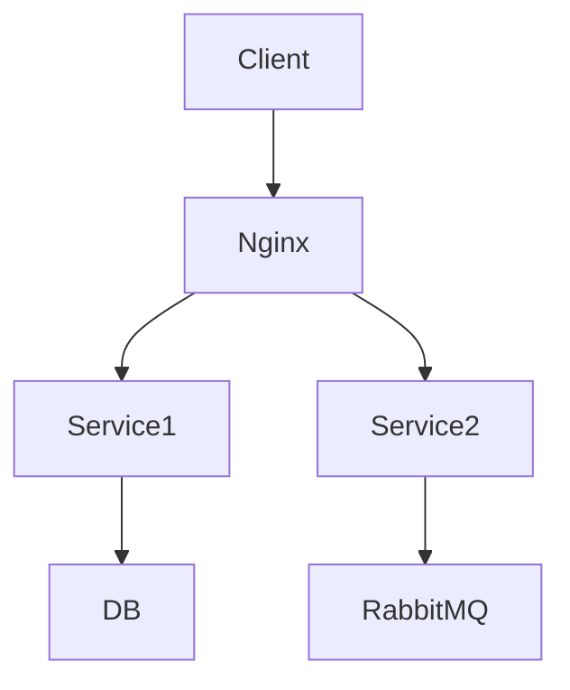
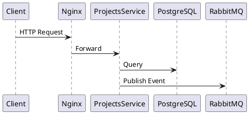

# План курсової роботи та підготовка GitHub репозиторію

## Аналіз готовності проекту

### ✅ Що вже готово (100%)

#### 1. Мікросервіси та архітектура
- [x] **Projects Service** - REST API з CRUD операціями
- [x] **Notifications Service** - обробка подій через RabbitMQ
- [x] **PostgreSQL** - реляційна БД
- [x] **RabbitMQ** - асинхронна комунікація
- [x] **Nginx** - load balancer та reverse proxy

#### 2. Інфраструктура та DevOps
- [x] Docker containerization для всіх сервісів
- [x] Docker Compose для локальної оркестрації
- [x] Горизонтальне масштабування (3+ репліки)
- [x] Load balancing (Nginx least_conn)
- [x] Health checks для всіх сервісів

#### 3. Моніторинг та спостерігання
- [x] Prometheus - збір метрик
- [x] Grafana - візуалізація
- [x] Loki - централізовані логи
- [x] Promtail - агрегація логів
- [x] Dashboard з основними метриками

#### 4. Тестування
- [x] k6 навантажувальні тести
- [x] Smoke tests
- [x] Load tests (до 100 VUs)
- [x] Результати та аналіз продуктивності
- [x] Скрипти автоматизації тестування

#### 5. Документація
- [x] ЛР1 - Аналіз вимог
- [x] ЛР6 - REST/gRPC/Async
- [x] ЛР7 - Оркестрація (Docker Compose)
- [x] ЛР8 - Моніторинг
- [x] ЛР9 - Тестування та масштабування
- [x] Посібники (SCALING, TESTING, DEPLOYMENT)
- [x] Відповіді на іспит

---

## 🎯 Що додати для курсової роботи

### 1. Основна документація (ПРІОРИТЕТ)

#### README.md для GitHub (головний файл)
**Зміст:**
- Назва проекту: "TaskFlow - Distributed Project Management System"
- Короткий опис та цілі
- Архітектурна діаграма
- Основні можливості
- Технологічний стек
- Швидкий старт
- Структура проекту
- Посилання на детальну документацію

#### КУРСОВА_РОБОТА.md (основний звіт)
**Розділи:**
1. Титульна сторінка
2. Зміст
3. Вступ
   - Актуальність теми
   - Мета та завдання
   - Об'єкт та предмет дослідження
4. Теоретична частина
   - Огляд розподілених систем
   - Мікросервісна архітектура
   - Патерни комунікації
   - Оркестрація контейнерів
5. Практична частина
   - Аналіз вимог
   - Проектування архітектури
   - Реалізація сервісів
   - Налаштування інфраструктури
   - Моніторинг та тестування
6. Результати
   - Розгорнута система
   - Метрики продуктивності
   - Результати тестування
7. Висновки
8. Список використаних джерел

#### ARCHITECTURE.md (архітектурна документація)
**Зміст:**
- High-level архітектура
- Компонентна діаграма
- Діаграма послідовності (sequence diagrams)
- Патерни проектування
- Технічні рішення та обґрунтування
- API специфікація

### 2. Візуалізації та діаграми

#### Діаграми для створення:
- [x] Архітектурна діаграма (C4 Model - Context)
- [ ] Компонентна діаграма (C4 Model - Container)
- [ ] Діаграма розгортання
- [ ] Sequence diagram для основних операцій
- [ ] Діаграма БД (ER-діаграма)
- [ ] Діаграма масштабування

**Інструменти:**
- PlantUML / Mermaid (текстові діаграми)
- Draw.io / Excalidraw
- Або ручне створення в MD з ASCII art

### 3. API Документація

#### OpenAPI/Swagger специфікація
- Файл: `openapi.yaml`
- Документація всіх endpoints
- Request/Response приклади
- Схеми даних

#### Postman Collection
- Колекція всіх API запитів
- Приклади використання
- Тестові сценарії

### 4. Додаткові тести

#### Unit тести (опціонально)
- Тести для контролерів
- Тести для сервісів
- Мокування залежностей

#### Integration тести
- Тести API endpoints
- Тести з БД
- Тести з RabbitMQ

### 5. CI/CD Pipeline

#### GitHub Actions
```yaml
.github/workflows/
├── ci.yml              # Continuous Integration
├── docker-build.yml    # Docker image builds
└── deploy.yml         # Deployment (опціонально)
```

**Етапи CI:**
- Lint (ESLint, TypeScript check)
- Build
- Tests (якщо є)
- Docker build
- Push to registry (опціонально)

### 6. Покращення коду

#### Необхідні зміни:
- [ ] Додати валідацію даних (Joi, Zod, class-validator)
- [ ] Покращити обробку помилок (централізований error handler)
- [ ] Додати логування (Winston, Pino)
- [ ] Environment variables validation
- [ ] Request logging middleware

#### Опціональні:
- [ ] JWT Authentication
- [ ] Rate limiting
- [ ] CORS налаштування
- [ ] Request validation

### 7. Deployment інструкції

#### Додати інструкції для:
- [ ] Локального розгортання (детальніше)
- [ ] Production deployment checklist
- [ ] Environment variables reference
- [ ] Backup та recovery процедури
- [ ] Troubleshooting guide

---

## 📁 Структура GitHub репозиторію

```
taskflow-distributed-system/
├── .github/
│   ├── workflows/
│   │   ├── ci.yml
│   │   └── docker-build.yml
│   └── ISSUE_TEMPLATE/
├── projects-service/
│   ├── src/
│   ├── Dockerfile
│   ├── package.json
│   └── README.md
├── notifications-service/
│   ├── src/
│   ├── Dockerfile
│   ├── package.json
│   └── README.md
├── nginx/
│   └── nginx.conf
├── monitoring/
│   ├── prometheus/
│   ├── grafana/
│   ├── loki/
│   └── promtail/
├── load-tests/
│   ├── smoke-test.js
│   ├── projects-load-test.js
│   └── README.md
├── docs/
│   ├── ARCHITECTURE.md
│   ├── API.md
│   ├── DEPLOYMENT.md
│   ├── КУРСОВА_РОБОТА.md
│   └── diagrams/
│       ├── architecture.png
│       ├── components.png
│       └── deployment.png
├── lab-reports/
│   ├── ЛР1_Аналіз_вимог.md
│   ├── ЛР6_REST_gRPC_Async.md
│   ├── ЛР7_Оркестрація.md
│   ├── ЛР8_Моніторинг.md
│   └── ЛР9_Тестування_Масштабування.md
├── scripts/
│   ├── scale.sh
│   ├── scale.bat
│   ├── test-monitoring.sh
│   └── test-orchestration.sh
├── .env.example
├── .gitignore
├── docker-compose.yml
├── docker-compose.scale.yml
├── LICENSE
└── README.md
```

---

## 🚀 План дій для підготовки репозиторію

### Фаза 1: Базова підготовка (30 хв)
1. [ ] Створити .gitignore
2. [ ] Створити LICENSE (MIT)
3. [ ] Створити .env.example
4. [ ] Створити головний README.md
5. [ ] Організувати файли по папках

### Фаза 2: Документація (2-3 год)
6. [ ] Написати КУРСОВА_РОБОТА.md
7. [ ] Створити ARCHITECTURE.md
8. [ ] Створити API.md (OpenAPI spec)
9. [ ] Покращити README для кожного сервісу
10. [ ] Додати діаграми

### Фаза 3: Код та тести (1-2 год)
11. [ ] Додати валідацію даних
12. [ ] Покращити error handling
13. [ ] Додати логування
14. [ ] Створити unit/integration тести (опціонально)

### Фаза 4: CI/CD (1 год)
15. [ ] Створити GitHub Actions workflows
16. [ ] Налаштувати Docker builds
17. [ ] Додати badges в README

### Фаза 5: Фінальні штрихи (30 хв)
18. [ ] Перевірити всі посилання
19. [ ] Перевірити форматування
20. [ ] Додати скріншоти/GIF демонстрації
21. [ ] Створити релізну версію (v1.0.0)

---

## 📊 Критерії готовності

### Для курсової роботи (мінімум):
- ✅ Повна документація (КУРСОВА_РОБОТА.md)
- ✅ Архітектурні діаграми
- ✅ Працюючий код всіх сервісів
- ✅ Результати тестування
- ✅ Висновки та рекомендації

### Для GitHub репозиторію (бажано):
- ✅ Професійний README
- ✅ Структурована документація
- ✅ .gitignore та .env.example
- ✅ CI/CD pipeline
- ⭕ Badges (build status, license)
- ⭕ Contributing guidelines
- ⭕ Code of Conduct

---

## 📝 Контрольний список перед публікацією

### Код:
- [ ] Всі секрети винесені в .env
- [ ] Немає hardcoded паролів
- [ ] Немає node_modules в git
- [ ] Коректні .gitignore файли
- [ ] Dockerfile оптимізовані

### Документація:
- [ ] README актуальний
- [ ] Інструкції перевірені
- [ ] Всі команди працюють
- [ ] Скріншоти актуальні
- [ ] Посилання коректні

### Тести:
- [ ] Smoke test проходить
- [ ] Load test виконується
- [ ] Документовані очікувані результати

### DevOps:
- [ ] Docker Compose працює
- [ ] Масштабування працює
- [ ] Моніторинг доступний
- [ ] Health checks працюють

---

## 🎓 Рекомендації для захисту курсової

### Що підготувати:
1. **Презентація** (10-15 слайдів):
   - Титульний слайд
   - Актуальність та мета
   - Архітектура системи
   - Технології
   - Реалізація (ключові моменти)
   - Результати тестування
   - Демо (скріншоти/відео)
   - Висновки

2. **Демонстрація**:
   - Запуск системи
   - Виконання тестів
   - Моніторинг дашборди
   - Масштабування

3. **Підготовка до питань**:
   - Чому обрали саме цю архітектуру?
   - Як працює масштабування?
   - Як обробляються помилки?
   - Які є альтернативи?
   - Що можна покращити?

---

## 🔧 Інструменти для створення діаграм

### Online:
- **draw.io** - https://app.diagrams.net/
- **Excalidraw** - https://excalidraw.com/
- **PlantUML Online** - http://www.plantuml.com/plantuml/

### VS Code Extensions:
- PlantUML
- Mermaid Preview
- Draw.io Integration

### Приклади синтаксису:

#### Mermaid (вбудований в GitHub):


#### PlantUML:


---

## 📌 Наступні кроки

1. **ЗАРАЗ**: Створити базову структуру GitHub репозиторію
2. **Сьогодні**: Написати головний README.md
3. **Завтра**: Створити КУРСОВА_РОБОТА.md
4. **Цього тижня**: Додати діаграми та API документацію
5. **Наступний тиждень**: CI/CD та фінальні штрихи

---

**Статус готовності:** ~75% (код + тести + базова документація)
**Що залишилось:** Курсова робота (MD), діаграми, API docs, CI/CD
**Часозатрати:** 6-8 годин роботи
